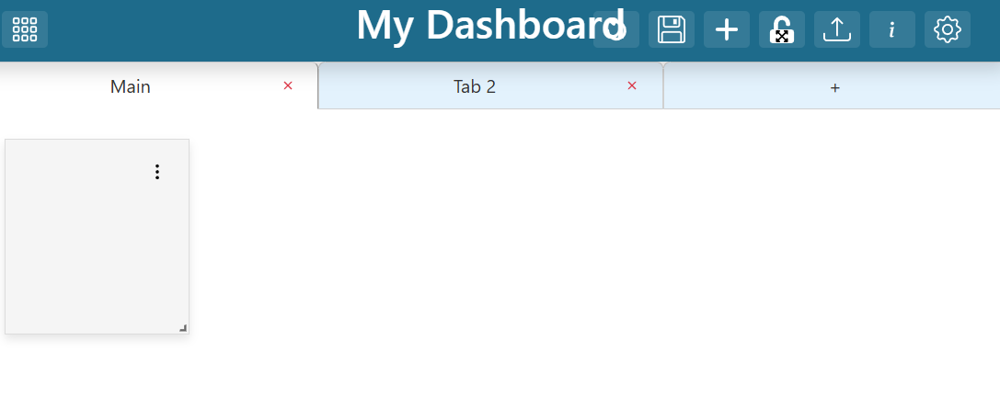
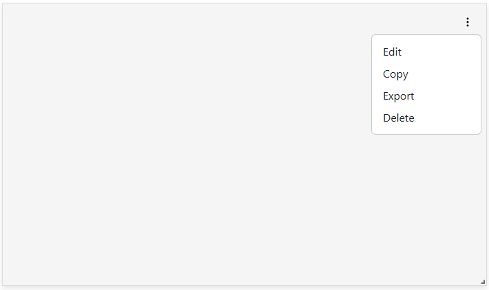

.. _dashboard_editing:

.. |dashboard_edit_button| image:: ../images/dashboard_edit_button.png
   :scale: 50%

.. |dashboard_add_item_button| image:: ../images/dashboard_add_item_button.png
   :scale: 50%

Editing Dashboards
==================

Users can edit dashboards they own or have editor/admin access to. After selecting a dashboard, click the |dashboard_edit_button| in the app header to enter edit mode. In edit mode, you can:

- Add, move, resize, or delete dashboard items
- Add and rename tabs to organize content
- Use the context menu on each item to edit, copy, delete, or export visualizations
- Save or revert changes

.. image:: ../images/dashboard_edit_mode.png
   :align: center

|

Tabs
----

Tabs help organize dashboard content. Click the plus sign at the top to add a tab. Rename tabs by clicking their name. Tabs can reference information from other tabs.

|

Adding Dashboard Items
----------------------

To add a new dashboard item, click the "Add Dashboard Item" (|dashboard_add_item_button|) button in the header. A new item appears in the top left corner. Move items by dragging, and resize using the handle in the bottom right corner.

.. image:: ../images/add_dashboard_item.png
   :align: center

.. image:: ../images/add_dashboard_item_new.png
   :align: center

|

Dashboard Item Context Menu
---------------------------

Each dashboard item has a context menu (top right) for editing, copying, deleting, or exporting the visualization.

|