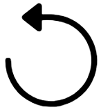

.. _dashboard_settings:

.. |dashboard_settings_button| image:: ../images/dashboard_settings_button.png
   :scale: 10%

Dashboard Settings & Saving
===========================

Dashboard Settings
------------------

When a dashboard is selected, a settings (|dashboard_settings_button|) button appears in the app header. Click it to open the dashboard settings menu. If you created the dashboard, you can change and save all settings.

- **Name**: Appears in the URL for public dashboards. Only letters and numbers are allowed. Names must be unique among your dashboards.
- **Description**: Shown when hovering over the dashboard card on the landing page.
- **Unrestricted Grid Item Placement**: Allows dashboard items to be placed anywhere, including overlapping.
- **Notes**: Write, save, and edit notes for the dashboard. Public dashboards show notes to all viewers.

At the bottom of the settings panel, you can copy, manage permissions, or delete the dashboard. More details are provided on the following pages.

Saving & Reverting Changes
--------------------------

- Click the |dashboard_save_button| in the app header to save your dashboard configuration. Saved changes persist when the app is refreshed or revisited.
- Click the |dashboard_revert_button| to revert to the last saved state.

.. warning::
   All changes will be lost if you exit the application without saving. Save frequently to avoid losing your work.
