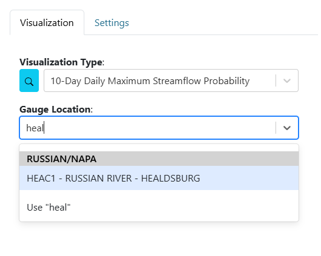

.. _dashboard_visualizations:

.. |search_visualizations_button| image:: ../images/search_visualizations_button.png
   :scale: 10%

Configuring Visualizations
==========================

Each dashboard item is a visualization that can be configured and customized. To edit a visualization, open the item's context menu and select "Edit." A popup appears with configuration options on the left and a live preview on the right.

.. image:: ../images/dashboard_edit_visualization.png
   :align: center
   :width: 800px

Visualization Tab
-----------------

- Select the type of visualization from a dropdown or use the search (|search_visualizations_button|) button.
- Hover over visualization cards to see descriptions, tags, and types.
- Type in dropdowns to filter options or add new ones.

After selecting a visualization type, additional arguments may appear, specific to that visualization. For example, a chart may require you to select a location.

Most visualizations are custom, based on installed plugins. For more information, see the :doc:`../plugins` section.

Default Visualization Types
---------------------------

- **Map**: Add a map with configurable basemaps, layers, extent, and drawing tools.
- **Custom Image**: Display a publicly accessible image.
- **Text**: Display formatted text.
- **Variable Input**: Create a variable for use in other visualizations. See :doc:`../variable_inputs` for details.
- **Live Chat**: Display a chat box for users to communicate in real time. Websocket must be configured for this visualization to work. See :doc:`../installation` for details.

Settings Tab
------------

- **Refresh Rate**: How often the visualization updates automatically (0 = no auto-refresh).
- **Border**: Style all or individual borders.
- **Background Color**: Set the background color and opacity.
- **Box Shadow**: Add a box shadow using border colors.
- **Show Attribution**: Display an attribution icon if available.
- **Custom Messaging**: Set custom error or empty-value messages.

.. tip::
   Settings may vary by visualization type. See the visualization's options for details.
