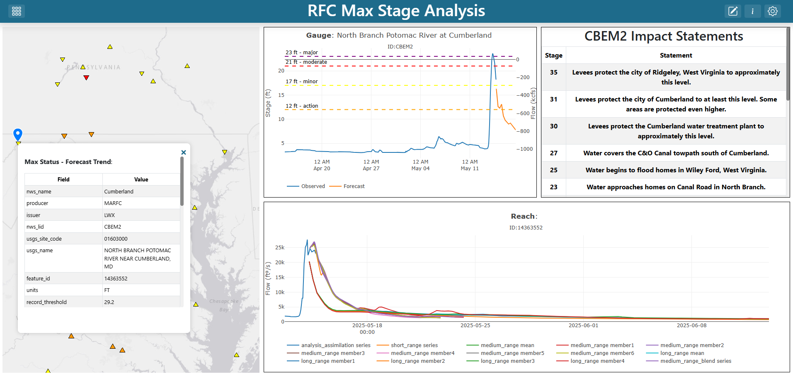

Welcome to the TethysDash Documentation!
========================================

**TethysDash** is a `Tethys Platform <https://www.tethysplatform.org/>`_ application that empowers users to create custom dashboards for streamlined data discovery.

With the TethysDash dashboard builder, users can easily add, configure, and arrange a variety of visualizations to display data from multiple sources in a cohesive and interactive way.

TethysDash provides a robust set of built-in visualization plugins and features for building effective dashboards and applications. Its true strength lies in flexibility and extensibility—dashboards can leverage preinstalled plugins to perform custom and complex analyses. For details on the plugin architecture and developing new plugins, see the :doc:`plugins` section.

Try the TethysDash demo: `https://demo.tethysgeoscience.org/apps/tethysdash/ <https://demo.tethysgeoscience.org/apps/tethysdash/>`_

   Example dashboard using multiple visualization plugins to display data from various sources.

|

For more information about creating and using dashboards, see the :ref:`dashboards` section.

.. note::

   This project is under active development.

Contents
--------

.. toctree::
   :maxdepth: 3

   installation
   landing_page
   dashboard
   variable_inputs
   plugins
   maps/maps
   tutorials/tutorials
   feedback
