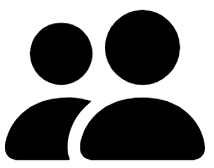
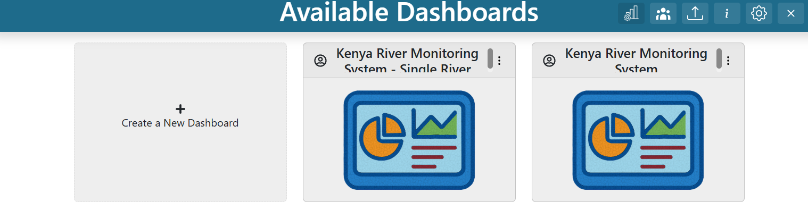
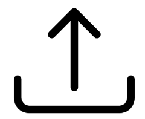

.. _landing_page:

Landing Page
============

The TethysDash landing page displays a summary of all dashboards available to the user, including those owned by the user and those shared publicly.

Dashboard Cards
---------------

Each card on the landing page represents a dashboard and displays its name, description, owner status, public status, and a thumbnail. Dashboards owned by the user are marked with the owner icon (|owner_icon|) in the top left corner, while public dashboards are marked with the public icon (|public_icon|). Hovering over a card reveals its description. The three-dot menu in the top right corner provides additional actions.

Creating a Dashboard
--------------------

To create a new dashboard, make sure you are signed into the Tethys portal. If the login icon (|login_icon|) appears in the app header, click it to sign in.

Once signed in, a blank dashboard card labeled "Create a New Dashboard" will appear. Click this card, enter a name and description, then click "Create".

Dashboard Card Context Menu
---------------------------

After clicking the three dots in the top right corner of a dashboard card, a context menu appears with the following options:

   .. image:: ../images/dashboard_context_menu.png
      :align: center

**Open**: View the dashboard. You can also double-click the card to open it.

**Rename** (*Admin Privileges Required*): Change the dashboard's name.

**Update Description** (*Editor Privileges Required*): Edit the dashboard description.

**Update Thumbnail** (*Editor Privileges Required*): Change the dashboard thumbnail.

**Share → Make Public** (*Admin Privileges Required*): Make the dashboard public so anyone can view it (read-only for others).

**Share → Copy Public URL**: Copy the dashboard's public URL to the clipboard.

**Share → Make Private** (*Admin Privileges Required*): Remove public access to the dashboard.

.. _share-update-permissions:

**Share → Update Permissions** (*Admin Privileges Required*): Manage which groups and users have access to the dashboard. A pop-up will appear to add users or groups and assign them as viewers, editors, or admins:
   - *Viewer*: Can see the dashboard but cannot edit it.
   - *Editor*: Can view and edit the dashboard's contents, description, and thumbnail.
   - *Admin*: Has all editor permissions, plus can manage sharing and rename the dashboard.
  
Granting access to a group gives all its members the specified level of access. The dashboard can also be made public.

   .. image:: ../images/manage_permissions.png
      :align: center
      :width: 400px

**Copy** (*Sign In Required*): Create a personal copy of the dashboard.

**Export**: Download the dashboard as a JSON file.

**Delete** (*Admin Privileges Required*): Permanently remove the dashboard.

Importing Dashboards
--------------------

To make it easier to share and update dashboards between TethysDash instances, dashboards can be imported using a structured JSON format. To import a dashboard, click the dashboard import icon (|dashboard_import_icon|) in the landing page header. Then select a JSON file to import.

The JSON structure should be as follows:

.. code-block:: json

   {
      "name": "dashboard name",
      "description": "dashboard description",
      "publicDashboard": true, // determines if the dashboard is public (optional, default is false)
      "unrestrictedPlacement": false, // allows dashboard items to overlap and be placed anywhere
      "notes": "dashboard notes", // notes viewable with the dashboard
      "tabs": [ // each object represents a tab in the dashboard
         {
            "id": 1, // unique integer ID for the tab
            "name": "Tab 1", // name of the tab
            "gridItems": [ // each object represents an individual visualization in the dashboard
               {
                  "i": 1, // unique integer ID for the item
                  "x": 0, // x coordinate (top left)
                  "y": 0, // y coordinate (top left)
                  "w": 33, // width (grid units)
                  "h": 44, // height (grid units)
                  "source": "Text", // source or intake driver name for the visualization (example)
                  "args_string": { // arguments for the intake driver (example)
                     "text": "Example Text"
                  },
                  "metadata_string": { // custom settings for the item (example). See below for options
                     "border": {
                        "border": "1px solid black"
                     },
                     "customMessaging": {
                        "error": "A custom error"
                     }
                  }
               }
            ]
         }
      ]
   }

The following options are available for the metadata_string key:
   
   * **border** (object)
      * **border**: Style for all borders (e.g., "1px solid black").
      * **border-bottom**: Style for the bottom border.
      * **border-top**: Style for the top border.
      * **border-left**: Style for the left border.
      * **border-right**: Style for the right border.
   
   * **boxShadow** (string): Box shadow style (e.g., "4px 0 8px black").
   
   * **backgroundColor** (string): Background color (name, hex, etc).
   
   * **customMessaging** (object)
      * **error**: Custom error message for visualization errors.
      * **<Variable Input Name>**: Custom message when a Variable Input has no value.
   
   * **refreshRate** (integer): Time interval (in seconds) to refresh the visualization.
  
   * Any additional settings for specific visualizations (see :ref:`settings_tab`).

Manage Visualization Permissions
--------------------------------

When creating plugins (see :ref:`here <visualizationplugins>`), you can set the ``visualization_permissions`` parameter. By default, it is ``false``. If set to ``true``, permissions can be updated for that specific visualization, allowing you to add group names or usernames. Only users with permission will be able to access those visualizations.

If none of the plugins include this option, visualization permissions cannot be adjusted on the landing page.

Manage Groups
-------------

Manage Groups lets you create user groups so you can grant access to an entire group at once, rather than selecting users individually. To manage groups, click the group icon in the upper right corner. This opens a pop-up window where you can edit, delete, or create groups.

   .. image:: ../images/permission_groups.png
      :align: center
      :width: 400px

To create a new group, click **Create New Group**, enter a name and description, and add users by their username. Users can be *members* or *admins*; group admins can edit the group.

   .. image:: ../images/add_permission_group.png
      :align: center
      :width: 400px

