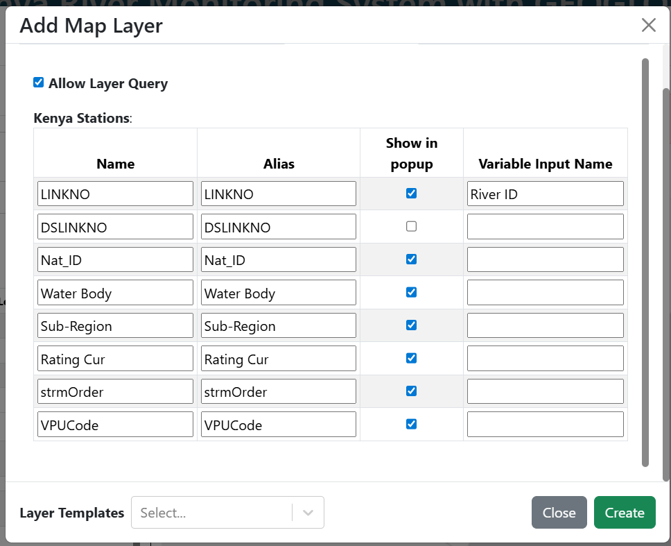
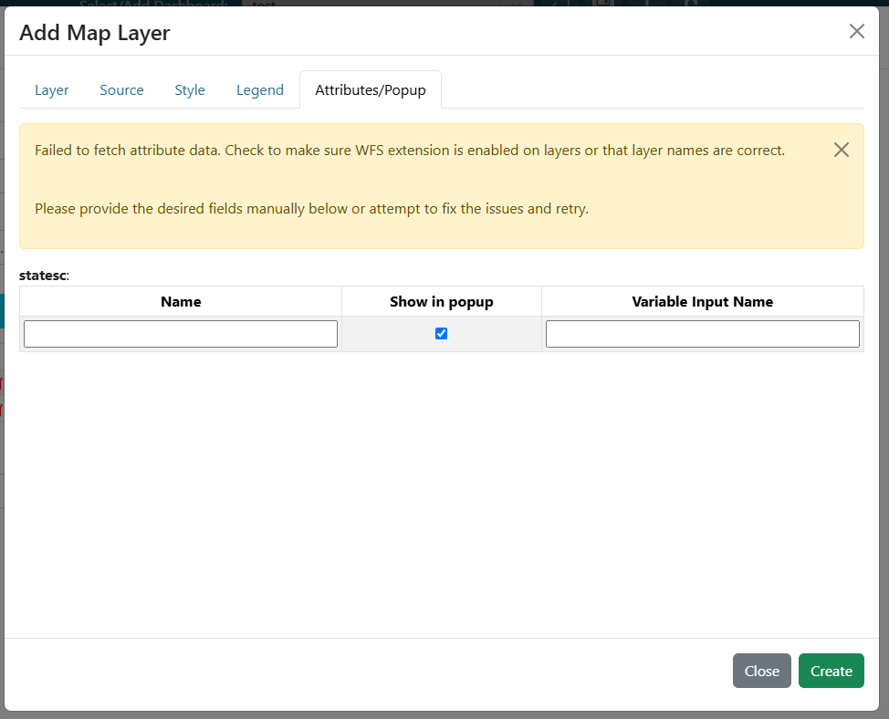

.. _attributes_and_popups_tab:

--------------------
Attributes/Popup Tab
--------------------

The Attributes/Popup tab configures how users interact with a map layer when it is clicked.

**After configuring the layer name and required source properties**, a table of layers and their attributes will appear.

At the top of the tab, the "Allow Layer Query" checkbox enables click interaction for the layer. If unchecked, no attribute table will load and the layer will not be queryable.

Within this table, fields can be configured for click interaction in two ways:

    1. When a layer is clicked, a popup displays the attributes for the selected feature(s). You can hide attributes from the popup by unchecking the "Show in popup" column.

    2. Fields can be linked to variable inputs. See the :ref:`variableinputs` section for details. In the "Variable Input Name" column, add the desired variable input for the field whose value will be set when a feature is clicked.

.. note::
    You can configure a variable input in the attributes table without adding a separate variable input visualization to the dashboard. For example, a chart can reference a new variable input, and a map field can update that variable. When a map feature is clicked, the chart updates automatically with the field value—no need to change a dropdown or text input. See the example below.

    .. video:: ../videos/map_variable_input.mp4
        :autoplay:
        :loop:
        :class: variable-input-video

|

If the layer loads correctly, a static table will display the available attributes.

|

If the layer loads incorrectly, a dynamic table will appear, allowing you to add fields manually. New rows can be created by tabbing through the inputs.

|

If the layer loads correctly but no attributes are found, no table will be shown and a warning will indicate that no attributes were found.
