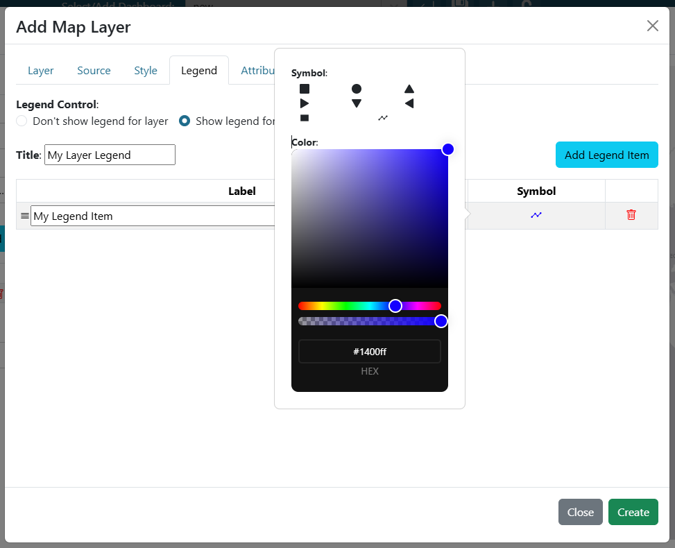

.. _legend_tab:

----------
Legend Tab
----------

The legend tab is used to configure a custom legend that will be show in the map legend menu. Legends for a specific layer can be toggled on or off. Users can choose to have "No Legend", "Default Legend", or "Custom Legend".

If a layer's legend is set to custom legend, then users will need to provide a legend title and at least 1 legend item. New legend 
items can be added using the "Add Legend Item" button. Legend items can then be configured with a 
label and a symbol.

In order to configure the symbol, click on the symbol in the table row and a popup will then show with additional 
layer symbols and colors to choose from. 

|

If default legend is selected, then if there is a default legend associated with the layer it will be shown.