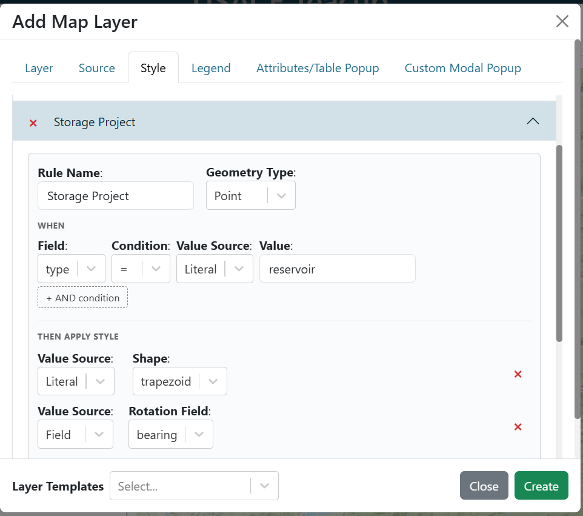
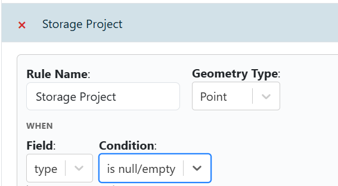
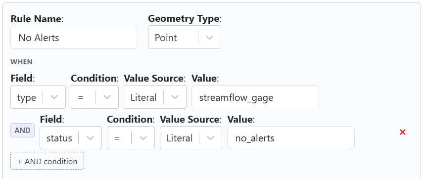
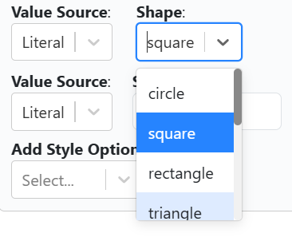
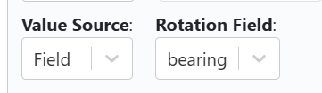

.. _style_tab:

---------
Style Tab
---------

The style tab lets you apply custom styles to map layers. Custom styling is available for GeoJSON, ESRI Feature Service, and PMTiles Vector layers. Two types of styling are supported:

**MapLibre Styling**: Follows the `MapLibre Style Spec <https://maplibre.org/maplibre-style-spec/>`_ and uses the `ol-mapbox-style applyStyle <https://openlayers.org/ol-mapbox-style/functions/applyStyle.html>`_ function. Refer to these resources to ensure your layers render correctly.

**Rule-Based Styling**: A simplified option that lets you create rules based on attribute values. You can combine rules and default styles for complex effects. Rule-based styling can be configured through a graphical interface, making it easier than writing custom JSON. For example, you can set a rule so that if the "population" attribute is greater than 1000, the feature is styled with a red fill color.

.. figure:: ../../images/rule_based_styling.png
    :align: center

    Example of rule-based styling using a simple interface to create rules based on attribute values.

.. _rule_based_styling:

++++++++++++++++++++
Rule-Based Styling
++++++++++++++++++++

Rule-based styling lets you define a set of rules that determine how each map feature is drawn. Rules are evaluated in order and the first matching rule wins. Features that match no rule fall back to the **Default** style.

The graphical rule editor is organized into two sections for each rule:

- **When** — one or more conditions that must all be true for the rule to apply.
- **Then apply style** — the visual style to use when the rule matches.

    Rule editor showing the WHEN / THEN layout for a single rule.

Rule Conditions
~~~~~~~~~~~~~~~

Each rule has at least one condition row. A condition row has three parts:

1. **Field** — the GeoJSON feature property to inspect (e.g. ``population``).
2. **Operator** — how to compare the field value.
3. **Value** — the threshold or target to compare against (hidden for ``isNull`` / ``isNotNull``).

The following operators are available:

.. list-table::
   :header-rows: 1
   :widths: 20 80

   * - Operator
     - Description
   * - ``=``
     - Field equals value (exact match, case-sensitive for strings).
   * - ``!=``
     - Field does not equal value.
   * - ``<``
     - Field is less than value (numeric comparison).
   * - ``<=``
     - Field is less than or equal to value.
   * - ``>``
     - Field is greater than value.
   * - ``>=``
     - Field is greater than or equal to value.
   * - ``isNull``
     - Field is absent, ``null``, or empty. No value input is shown.
   * - ``isNotNull``
     - Field is present and non-empty. No value input is shown.

    Condition row with ``isNull`` selected — the value input is hidden.

Compound AND Conditions
~~~~~~~~~~~~~~~~~~~~~~~

A single rule can require **multiple conditions** to all be true before it fires. Click the **+ AND condition** button below the condition row to add an extra condition. All conditions in the list must match for the rule to apply (logical AND).

You can add as many condition rows as needed and remove any individual row with its remove button.

    A rule with two AND conditions that must both be true for the rule to apply.

Field-to-Field Comparison
~~~~~~~~~~~~~~~~~~~~~~~~~

By default the **Value** in a condition row is a fixed literal (e.g. ``1000``). Each condition row also has a **Value Source** toggle that lets you compare a feature property against **another feature property** instead of a literal:

- **Literal** (default) — compare against a typed constant.
- **Field** — compare against the value of a different GeoJSON property on the same feature.

For example, setting Field = ``stage``, Operator = ``>``, Value Source = ``Field``, Value = ``bankfull`` will fire the rule on any feature where ``stage`` exceeds ``bankfull``.

Style Properties
~~~~~~~~~~~~~~~~

When a rule matches, the **Then apply style** section controls how the feature is drawn. The available style properties depend on the geometry type selected for the rule (Point, Line, or Polygon).

**Point styles**

.. list-table::
   :header-rows: 1
   :widths: 25 75

   * - Property
     - Description
   * - Shape
     - The point marker shape. See :ref:`point_shapes` below.
   * - Fill
     - Fill color (hex string, e.g. ``#FF0000``).
   * - Stroke
     - Stroke (outline) color.
   * - Stroke Width
     - Width of the stroke in pixels.
   * - Size
     - Overall size of the marker in pixels.
   * - Rotation
     - Rotation of the marker in degrees (clockwise from north). Accepts a literal value or a per-feature field reference (e.g. ``bearing``).

**Line styles**

.. list-table::
   :header-rows: 1
   :widths: 25 75

   * - Property
     - Description
   * - Stroke
     - Line color.
   * - Stroke Width
     - Line width in pixels.

**Polygon styles**

.. list-table::
   :header-rows: 1
   :widths: 25 75

   * - Property
     - Description
   * - Fill
     - Fill color.
   * - Stroke
     - Outline color.
   * - Stroke Width
     - Outline width in pixels.

.. _point_shapes:

Point Shapes
~~~~~~~~~~~~

The following shapes are available for point features:

.. list-table::
   :header-rows: 1
   :widths: 20 80

   * - Shape
     - Description
   * - Circle
     - Filled circle (default).
   * - Square
     - Regular four-sided polygon with flat sides.
   * - Rectangle
     - Wider rectangle marker.
   * - Triangle
     - Equilateral triangle pointing upward.
   * - Trapezoid
     - Canvas-drawn trapezoid shape.
   * - Star
     - Five-pointed star.
   * - Diamond
     - Canvas-drawn diamond (rotated square) shape.
   * - Cross
     - Plus-sign cross.
   * - X
     - Diagonal cross (×).
   * - Icon
     - Custom image icon. Specify a URL in the **Icon URL** field.

    Shape dropdown showing all available point marker shapes.

Per-Feature Property References (Literal | Field Toggle)
~~~~~~~~~~~~~~~~~~~~~~~~~~~~~~~~~~~~~~~~~~~~~~~~~~~~~~~~~

Every style property row in the **Then apply style** section has a **Value Source** toggle with two modes:

- **Literal** (default) — all features matching the rule share the same fixed style value.
- **Field** — the style value is read from a GeoJSON property on each individual feature.

Switching to **Field** reveals a field selector dropdown. Select the property whose value should drive the style. For example, setting Rotation's source to **Field** and choosing ``bearing`` orients each point to its recorded heading.

Switching back to **Literal** clears the field reference and restores the fixed value.

    Style property row with the Field source toggle active — the value is read from a per-feature GeoJSON property.

Rule-Based Style JSON Reference
~~~~~~~~~~~~~~~~~~~~~~~~~~~~~~~~

Rules are stored as JSON. Below is a complete example showing the full schema, including compound conditions and property references:

.. code-block:: json

    {
        "default": {
            "point": {
                "shape": "circle",
                "fill": "#AAAAAA",
                "stroke": "#FFFFFF",
                "strokeWidth": "1",
                "size": "8"
            }
        },
        "rules": [
            {
                "name": "High flow",
                "geometry": "point",
                "conditions": [
                    {
                        "conditionField": "stage",
                        "conditionType": ">",
                        "conditionValue": "bankfull",
                        "valueIsField": true
                    },
                    {
                        "conditionField": "data_quality",
                        "conditionType": "isNotNull"
                    }
                ],
                "style": {
                    "shape": "circle",
                    "fill": "#FF0000",
                    "stroke": "#000000",
                    "strokeWidth": "2",
                    "size": "12",
                    "rotation": "0",
                    "propertyRefs": {
                        "rotation": "bearing"
                    }
                }
            },
            {
                "name": "Missing data",
                "geometry": "point",
                "conditionField": "stage",
                "conditionType": "isNull",
                "style": {
                    "shape": "x",
                    "fill": "#888888",
                    "stroke": "#444444",
                    "strokeWidth": "1",
                    "size": "8"
                }
            }
        ]
    }

**Top-level keys**

- ``default`` — fallback style applied to features that match no rule. Contains geometry-type sub-keys (``point``, ``line``, ``polygon``).
- ``rules`` — ordered array of rule objects. First matching rule wins.

**Rule object fields**

.. list-table::
   :header-rows: 1
   :widths: 25 75

   * - Field
     - Description
   * - ``name``
     - Optional display name for the rule. Auto-generated from the condition if omitted.
   * - ``geometry``
     - Geometry type this rule applies to: ``"point"``, ``"line"``, or ``"polygon"``.
   * - ``conditionField``
     - *(Legacy single-condition)* GeoJSON property name to test.
   * - ``conditionType``
     - *(Legacy single-condition)* Operator string (``=``, ``!=``, ``<``, ``<=``, ``>``, ``>=``, ``isNull``, ``isNotNull``).
   * - ``conditionValue``
     - *(Legacy single-condition)* Value to compare against. Omit for ``isNull`` / ``isNotNull``.
   * - ``valueIsField``
     - *(Legacy single-condition)* Set ``true`` to compare ``conditionField`` against the feature property named by ``conditionValue`` instead of a literal.
   * - ``conditions``
     - Array of condition objects (see below). When present, all entries must match (AND logic). Takes precedence over the legacy top-level condition fields.
   * - ``style``
     - Style object (see *Style object fields* below).

**Condition object fields** (entries in ``conditions[]``)

.. list-table::
   :header-rows: 1
   :widths: 25 75

   * - Field
     - Description
   * - ``conditionField``
     - GeoJSON property name to test.
   * - ``conditionType``
     - Operator string.
   * - ``conditionValue``
     - Value or field name to compare against. Omit for ``isNull`` / ``isNotNull``.
   * - ``valueIsField``
     - Set ``true`` to treat ``conditionValue`` as the name of another feature property.

**Style object fields**

.. list-table::
   :header-rows: 1
   :widths: 25 75

   * - Field
     - Description
   * - ``shape``
     - Point shape name (see :ref:`point_shapes`). Point layers only.
   * - ``fill``
     - Fill color (hex string). Points and polygons.
   * - ``stroke``
     - Stroke/outline color (hex string).
   * - ``strokeWidth``
     - Stroke width in pixels (string-encoded number).
   * - ``size``
     - Marker size in pixels (string-encoded number). Points only.
   * - ``rotation``
     - Rotation in degrees, clockwise from north (string-encoded number). Points only. Default ``"0"``.
   * - ``iconUrl``
     - Image URL for the ``"icon"`` shape. Points only.
   * - ``propertyRefs``
     - Object mapping style key names to GeoJSON property names. At render time each mapped style value is replaced with the corresponding per-feature property value. For example, ``{"rotation": "bearing"}`` orients every point to its ``bearing`` property.

+++++++
Example
+++++++

GeoJSON::

    {
        "type": "FeatureCollection",
        "crs": {
            "properties": {
                "name": "EPSG:3857"
            }
        },
        "features": [
            {
                "type": "Feature",
                "geometry": {
                    "type": "Point",
                    "coordinates": [
                        0,
                        0
                    ]
                }
            }
        ]
    }

.. figure:: ../../images/geojson.png
    :align: center

    GeoJSON layer without custom styling

Rule-Based Style JSON Example::

    {
        "default": {
            "point": {
                "stroke": "#FFFFFF",
                "size": "8",
                "fill": "#FF0000",
                "strokeWidth": "2"
            }
        }
    }

MapLibre Style JSON Example::

    {
        "version": 8,
        "sources": {
            "my-geojson-source": {
                "type": "geojson"
            }
        },
        "layers": [
            {
                "id": "points-layer",
                "type": "circle",
                "source": "my-geojson-source",
                "filter": [
                    "==",
                    "$type",
                    "Point"
                ],
                "paint": {
                    "circle-radius": 8,
                    "circle-color": "#FF0000",
                    "circle-stroke-width": 2,
                    "circle-stroke-color": "#FFFFFF"
                }
            }
        ]
    }

.. figure:: ../../images/styled_geojson.png
    :align: center

    GeoJSON layer with custom styling

.. warning::
    For map libre styling to work, the "sources" key in the JSON object must match the layer name from the layer tab. For example, if your layer is named "My Beautiful Layer", the styling JSON should look like::

        {
            "version": 8,
            "name": ...,
            "sprite": ...,
            "glyphs": ...,
            "sources": {
                "My Beautiful Layer": {...}
            },
            "layers": [...]
        }
