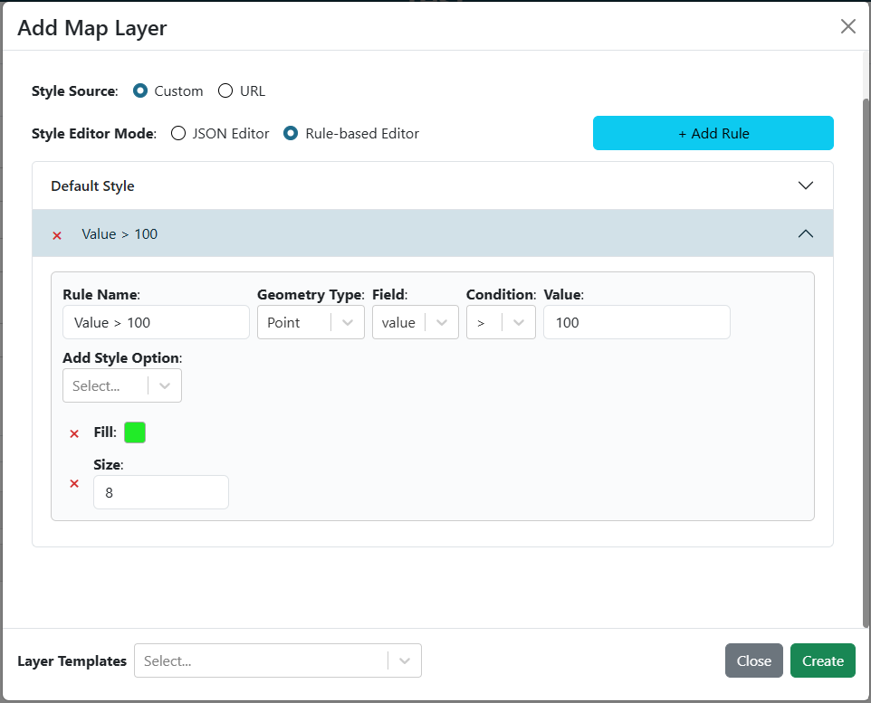
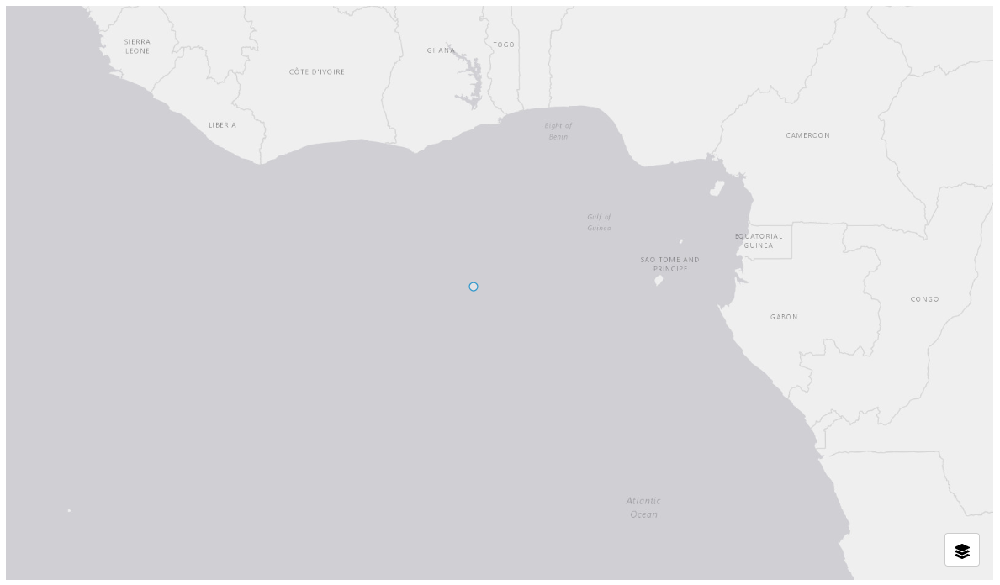
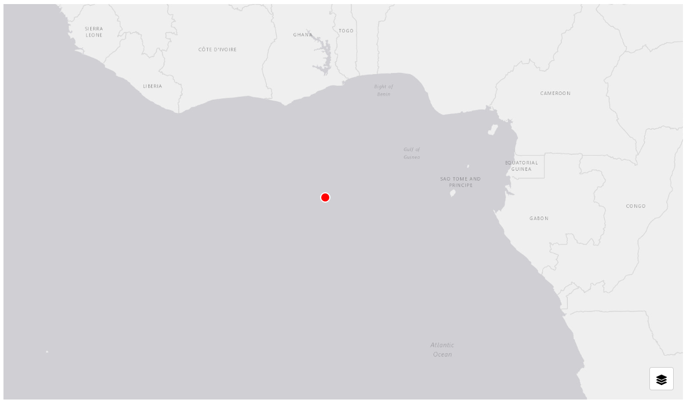

.. _style_tab:

---------
Style Tab
---------

The style tab lets you apply custom styles to map layers. Custom styling is available for GeoJSON, ESRI Feature Service, and PMTiles Vector layers. Two types of styling are supported:

**MapLibre Styling**: Follows the `MapLibre Style Spec <https://maplibre.org/maplibre-style-spec/>`_ and uses the `ol-mapbox-style applyStyle <https://openlayers.org/ol-mapbox-style/functions/applyStyle.html>`_ function. Refer to these resources to ensure your layers render correctly.

**Rule-Based Styling**: A simplified option that lets you create rules based on attribute values. You can combine rules and default styles for complex effects. Rule-based styling can be configured through a graphical interface, making it easier than writing custom JSON. For example, you can set a rule so that if the "population" attribute is greater than 1000, the feature is styled with a red fill color.

    Example of rule-based styling using a simple interface to create rules based on attribute values.

+++++++
Example
+++++++

GeoJSON::

    {
        "type": "FeatureCollection",
        "crs": {
            "properties": {
                "name": "EPSG:3857"
            }
        },
        "features": [
            {
                "type": "Feature",
                "geometry": {
                    "type": "Point",
                    "coordinates": [
                        0,
                        0
                    ]
                }
            }
        ]
    }

    GeoJSON layer without custom styling

Rule-Based Style JSON Example::

    {
        "default": {
            "point": {
                "stroke": "#FFFFFF",
                "size": "8",
                "fill": "#FF0000",
                "strokeWidth": "2"
            }
        }
    }

MapLibre Style JSON Example::

    {
        "version": 8,
        "sources": {
            "my-geojson-source": {
                "type": "geojson"
            }
        },
        "layers": [
            {
                "id": "points-layer",
                "type": "circle",
                "source": "my-geojson-source",
                "filter": [
                    "==",
                    "$type",
                    "Point"
                ],
                "paint": {
                    "circle-radius": 8,
                    "circle-color": "#FF0000",
                    "circle-stroke-width": 2,
                    "circle-stroke-color": "#FFFFFF"
                }
            }
        ]
    }

    GeoJSON layer with custom styling

.. warning::
    For map libre styling to work, the "sources" key in the JSON object must match the layer name from the layer tab. For example, if your layer is named "My Beautiful Layer", the styling JSON should look like:

        {
            "version": 8,
            "name": ...,
            "sprite": ...,
            "glyphs": ...,
            "sources": { 
                "My Beautiful Layer": {...}
            },
            "layers": [...]
        }
