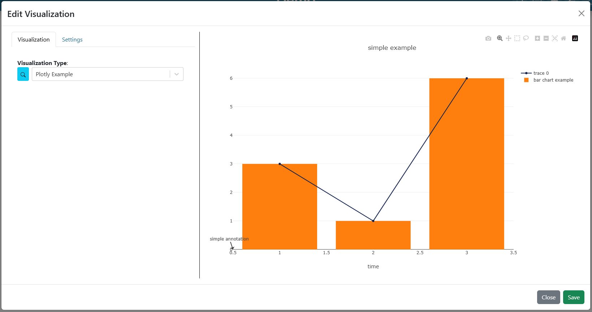
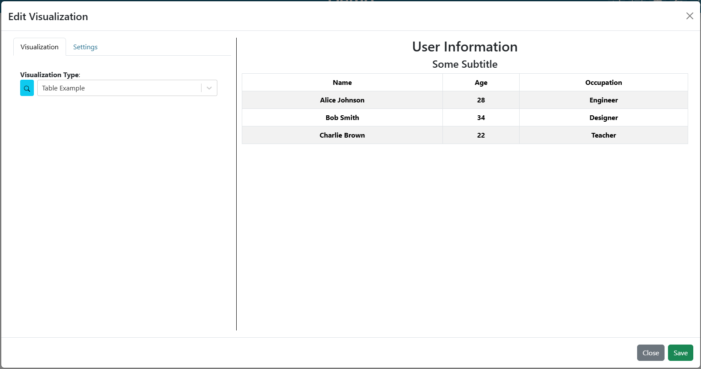
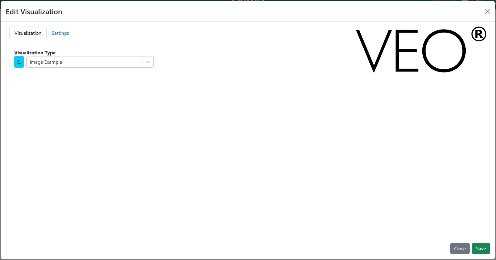
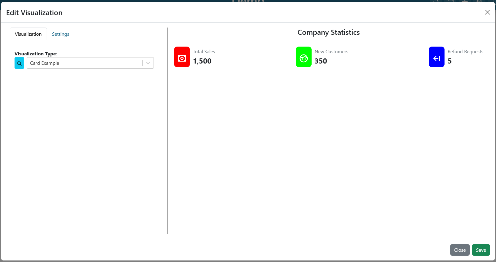
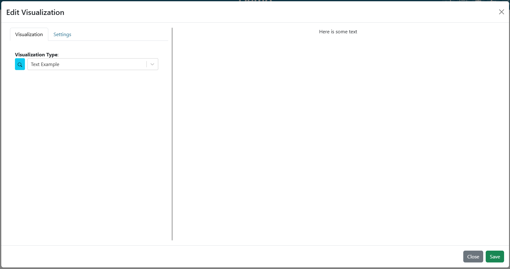
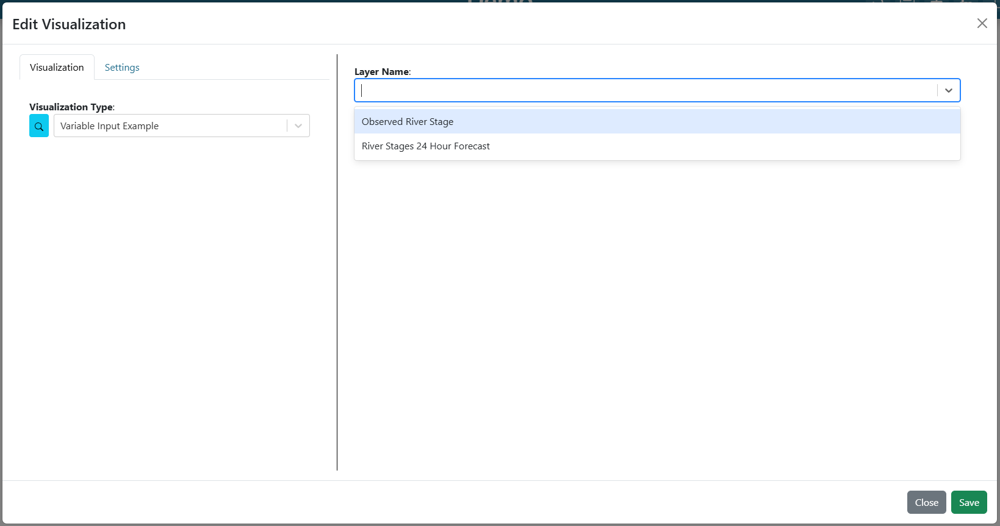
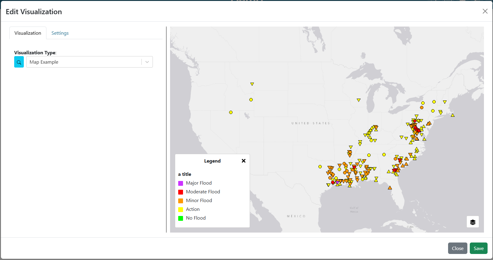
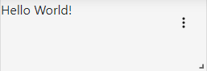
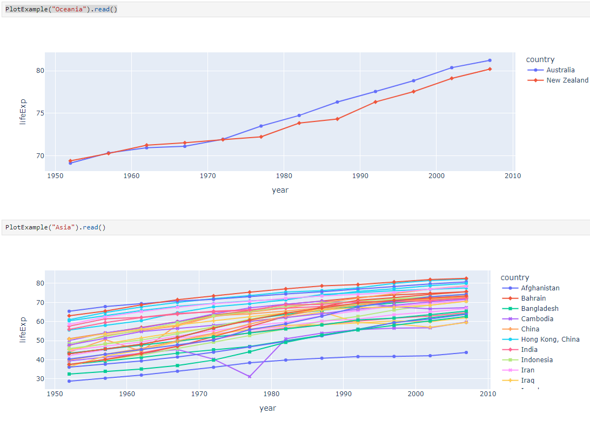

.. _visualizationplugins:

Visualization Plugins
=====================

Dashboard visualization plugins are created by subclassing the `TethysDashPlugin` base class, which provides integration with the `intake <https://github.com/intake/intake>`_ package. While TethysDash uses Intake under the hood, plugin authors should focus on implementing subclasses of `TethysDashPlugin` rather than writing intake drivers directly. This section covers the requirements for creating plugins specifically for TethysDash, including setup, required properties, and methods. For examples, see the `TethysDash Plugin Template repository <https://github.com/FIRO-Tethys/tethysdash_plugin_template>`_.

Development
-----------

=====================
Creating a repository
=====================


Before developing a plugin, create a new repository for it. This allows others to clone and install the package as needed. While the file structure is flexible, following the structure in the `TethysDash Plugin Template repository <https://github.com/FIRO-Tethys/tethysdash_plugin_template>`_ is recommended for compatibility. Be sure to add a static folder with visualization thumbnails to make your plugin easier to discover when users browse available visualizations (:doc:`dashboard_visualizations`).

=======================
TethysDash Plugin Class
=======================


TethysDash offers a base class, `TethysDashPlugin`, for building custom visualization plugins. To create a plugin, subclass `TethysDashPlugin` and define the required properties described below. The primary method to implement is `run`, which TethysDash will call to generate and return the visualization data.::


    from tethysapp.tethysdash.plugin_helpers import TethysDashPlugin
    import plotly.express as px
    import json

    class PlotExample(TethysDashPlugin):
        name = 'plot_example'
        args = {"continent": "text"}
        group = "Example"
        label = "Example Plot"
        type = "plotly"
        tags = [
            "example",
            "plotly",
        ]
        description = "An example plugin for the plotly visualization"

        def run(self):
            """Return a version of the xarray with all the data in memory"""
            df = px.data.gapminder().query(f"continent == '{self.continent}'")
            fig = px.line(df, x="year", y="lifeExp", color="country", symbol="country")
            return json.loads(fig.to_json())

Properties:
    - **name**: (required) Name of the package. Used for installation and as the driver name (e.g., `intake.open_<driver_name>`).
    - **group**: (required) Used to group visualizations in the dashboard app.
    - **label**: (required) The display name for the visualization in the dashboard app.
    - **type**: (required) The type of visualization. Must be "plotly", "table", "image", "card", "text", "variable_input", "map", "map_layer", or "custom". See the `Plugin Visualization Types <Plugin Visualization Types_>`_ section for details.
    - **args**: Dictionary of function arguments as keys and data types as values. Used to dynamically create HTML inputs. Values can be `HTML Input Types <https://www.w3schools.com/html/html_form_input_types.asp>`_ or a list for dropdowns (e.g., `{"year": "number", "location": "text", "available_colors": ["red", "blue", "white"]}`). These args are set as attributes of the plugin class and can be used in the run method using self (e.g., `self.year`, `self.location`, `self.available_colors`).
    - **tags**: List of tags for search and discovery.
    - **description**: Description of the visualization.
    - **restricted**: Boolean to restrict access to the plugin. If true, the plugin will only be visible to users with permissions. Defaults to false.
    - **loading_icon**: Boolean to enable a loading icon when the plugin is loading data. Defaults to true.
    - **attribution**: Description of the data source for attribution purposes. Optional.
Methods:
    - **run**: The main function to implement. The dashboard app calls this method and uses its results as the visualization data.
    - **send_update**: A method to send updates from the plugin to the dashboard app. Useful for long-running processes to provide progress updates. See the `Sending Progress Updates`_ section for more information.

==========================
Plugin Visualization Types
==========================

Plotly Chart
````````````

Displays a `Plotly <https://plotly.com/python/>`_ chart with the provided data, layout, and configuration. 



|

**visualization_type:** *plotly*

**read return: (dictionary)**
    - **data** (required): A list of plotly traces (see `Scatter Trace <https://plotly.com/javascript/reference/scatter/>`_ as an example)
    - **layout** (optional): A dictionary of a `Plotly Layout <https://plotly.com/python-api-reference/generated/plotly.graph_objects.Layout.html#plotly-graph-objs-layout>`_ configuration.
    - **config** (optional): A dictionary of a `Plotly Figure configuration <https://plotly.com/javascript/configuration-options/>`_ for adding buttons, interactions, etc.

**Example**: ::

    from tethysapp.tethysdash.plugin_helpers import TethysDashPlugin
    import plotly.graph_objects as go

    class PlotlyExample(TethysDashPlugin):
        name = "plotly_example"
        group = "Example"
        label = "Plotly Example"
        type = "plotly"
        tags = [
            "example",
            "plotly",
        ]
        description = "An example plugin for the plotly visualization"

        def run(self):
            """Return plotly information"""

            Return plotly information
            """
            data = [
                {
                    "type": "scatter",  # all "scatter" attributes: https://plotly.com/javascript/reference/#scatter
                    "x": [1, 2, 3],  # more about "x": #scatter-x
                    "y": [3, 1, 6],  # #scatter-y
                    "marker": {  # marker is an object, valid marker keys: #scatter-marker
                        "color": "rgb(16, 32, 77)"  # more about "marker.color": #scatter-marker-color
                    },
                },
                {
                    "type": "bar",  # all "bar" chart attributes: #bar
                    "x": [1, 2, 3],  # more about "x": #bar-x
                    "y": [3, 1, 6],  # #bar-y
                    "name": "bar chart example",  # bar-name
                },
            ]

            layout = {  # all "layout" attributes: #layout
                "title": "simple example",  # more about "layout.title": #layout-title
                "xaxis": {  # all "layout.xaxis" attributes: #layout-xaxis
                    "title": "time"  # more about "layout.xaxis.title": #layout-xaxis-title
                },
                "annotations": [  # all "annotation" attributes: #layout-annotations
                    {
                        "text": "simple annotation",  # #layout-annotations-text
                        "x": 0,  # #layout-annotations-x
                        "xref": "paper",  # #layout-annotations-xref
                        "y": 0,  # #layout-annotations-y
                        "yref": "paper",  # #layout-annotations-yref
                    }
                ],
            }

            config = {"displayModeBar": True}

            return {"data": data, "layout": layout, "config": config}

|

Table
`````

Displays a table from the provided data.



|

**visualization_type:** *table*

**read return: (dictionary)**
    - **title** (required): The title to display above the table
    - **subtitle** (optional): The subtitle to display above the table
    - **data** (required): A list of dictionaries containing keys/values for columns and rows respectively.

**Example**: ::

    from tethysapp.tethysdash.plugin_helpers import TethysDashPlugin

    class TableExample(TethysDashPlugin):
        name = "table_example"
        group = "Example"
        label = "Table Example"
        type = "table"
        tags = [
            "example",
            "table",
        ]
        description = "An example plugin for the table visualization"

        def run(self):
            """
                Return table data
            """

            data = [
                {
                    "name": "Alice Johnson",
                    "age": 28,
                    "occupation": "Engineer",
                },
                {
                    "name": "Bob Smith",
                    "age": 34,
                    "occupation": "Designer",
                },
                {
                    "name": "Charlie Brown",
                    "age": 22,
                    "occupation": "Teacher",
                },
            ]
            title = "User Information"
            subtitle = "Some Subtitle"

            return {
                "title": title,
                "subtitle": subtitle,
                "data": data
            }

|

Image
`````

Displays an image based on the returned URL string.



|

**DataSource visualization_type value:** *image*

**read return: (string)**
    - A string containing the url to the image

**Example**: ::

    from tethysapp.tethysdash.plugin_helpers import TethysDashPlugin


    class ImageExample(TethysDashPlugin):
        name = "image_example"
        group = "Example"
        label = "Image Example"
        type = "image"
        tags = [
            "example",
            "image",
        ]
        description = "An example plugin for the image visualization"

        def run(self):
            """
            Return an image url
            """

            return "https://aquaveo.com/pub/media/wysiwyg/aquaveo-logo-bw.svg"

|

Card
````

Displays a list of information in a card based fashion where each element in the dictionary can have its own color, 
value, label, and icon. 



|

**DataSource visualization_type value:** *card*

**read return: (dictionary)**
    - **title** (required): The title to display above the cards
    - **data** (required): A list of dictionaries containing the following keys.
        - **color** (Optional): hex or word based colors. Defaults to "black"
        - **label** (Optional): label for the card. Defaults to 0
        - **value** (Optional): value to display on the card. Defaults to "No Data Found"
        - **icon** (Optional): any `React Icon BI <https://react-icons.github.io/react-icons/icons/bi/>`_ icon

**Example**: ::

    from tethysapp.tethysdash.plugin_helpers import TethysDashPlugin

    class CardExample(TethysDashPlugin):
        name = "card_example"
        group = "Example"
        label = "Card Example"
        type = "card"
        tags = [
            "example",
            "card",
        ]
        description = "An example plugin for the card visualization"

        def run(self):
            """
                Return the data for the cards
            """

            data = [
                {
                    'color': '#ff0000', # Background color for the icon (in hex format)
                    'label': 'Total Sales', # Title or label for the statistic
                    'value': '1,500', # Value of the statistic
                    'icon': 'BiMoney' # Icon to display
                },
                {
                    'color': '#00ff00',
                    'label': 'New Customers',
                    'value': '350',
                    'icon': 'BiFace'
                },
                {
                    'color': '#0000ff',
                    'label': 'Refund Requests',
                    'value': '5',
                    'icon': 'BiArrowFromRight'
                },
            ]

            return {
                "title": "Company Statistics",
                "data": data
            }

|

Text
````

Displays custom text



|

**DataSource visualization_type value:** *text*

**read return: (dictionary)**
    - **text** (required): The text to show.

**Example**: ::

    from tethysapp.tethysdash.plugin_helpers import TethysDashPlugin

    class TextExample(TethysDashPlugin):
        name = "text_example"
        group = "Example"
        label = "Text Example"
        type = "text"
        tags = [
            "example",
            "text",
        ]
        description = "An example plugin for the text visualization"

        def run(self):
            """
                Return the data for the text
            """

            return {"text": "Here is some text"}

|

Variable Input
``````````````

Displays a variable input



|

**DataSource visualization_type value:** *variable_input*

**read return: (dictionary)**
    - **variable_name** (required): Name of the variable input
    - **initial_value** (required): Initial value of the variable input
    - **variable_options_source** (required): can be "text", "number", "checkbox", and array (as shown in the example)

**Example**: ::

    from tethysapp.tethysdash.plugin_helpers import TethysDashPlugin

    class VariableInputExample(TethysDashPlugin):
        name = "variable_input_example"
        group = "Example"
        label = "Variable Input Example"
        type = "variable_input"
        tags = [
            "example",
            "variable input",
        ]
        description = "An example plugin for the variable input visualization"

        def run(self):
            """
                Return the data for the variable input
            """
            layer_names = [
                {"label": "Observed River Stage", "value": 0},
                {"label": "River Stages 24 Hour Forecast", "value": 1},
            ]

            return {
                "variable_name": "Layer Name",
                "initial_value": "",
                "variable_options_source": layer_names,
            }

|

Map
```

Displays a map with the given layers and configuration. The map visualization is based on OpenLayers and follows similar 
configurations for configs and layers.



|

**DataSource visualization_type value:** *map*

**read return: (dictionary)**
    - **baseMap** (required): string for ESRI BaseMap Layers
    - **viewConfig** (optional): Dictionary containing configurations for the map view. Check `OpenLayers documentation <https://openlayers.org/en/latest/apidoc/module-ol_View-View.html>`_ for more information.
    - **mapConfig** (optional): Dictionary containing configurations for the map view div.
    - **layers** (optional): A list of layers to include in the map. The following keys can be in each object in the array.
        - **configuration** (required): See maps :ref:`source_tab` for more information. 
        - **attributeVariables** (Optional): an object that maps a layers name (key) with the layers field and desired variable inputs to update the field value. See maps :ref:`attributes_and_popups_tab` for more information.
        - **legend** (required): an object that contains a title key and items key. The items key value is an array of object with label and color keys for the legend.
        - **style** (required): See maps :ref:`legend_tab` for more information.
    - **layerControl** (optional): A boolean indicating if a layer control should be available.

**Example**: ::

    from tethysapp.tethysdash.plugin_helpers import TethysDashPlugin


    class Plots(TethysDashPlugin):
        group = "Example"
        label = "Map Example"
        type = "map"
        tags = [
            "example",
            "map",
        ]
        description = "An example plugin for the map visualization"


        def run(self):

            return {
                "baseMap": "https://server.arcgisonline.com/arcgis/rest/services/Canvas/World_Light_Gray_Base/MapServer",
                "layers": [
                    {
                        "configuration": {
                            "type": "ImageLayer",
                            "props": {
                                "name": "asda",
                                "source": {
                                    "type": "ESRI Image and Map Service",
                                    "props": {
                                        "url": "https://maps.water.noaa.gov/server/rest/services/rfc/rfc_max_forecast/MapServer"
                                    },
                                },
                            },
                        },
                        "attributeVariables": {
                            "Max Status - Forecast Trend": {"nws_lid": "Location"}
                        },
                        "legend": {
                            "title": "a title",
                            "items": [
                                {
                                    "label": "Major Flood",
                                    "color": "#cc33ff",
                                },
                                {
                                    "label": "Moderate Flood",
                                    "color": "#ff0000",
                                },
                                {
                                    "label": "Minor Flood",
                                    "color": "#ff9900",
                                },
                                {
                                    "label": "Action",
                                    "color": "#ffff00",
                                },
                                {
                                    "label": "No Flood",
                                    "color": "#00ff00",
                                }
                            ],
                        },
                    },
                ],
                "layerControl": True,
            }

|

Map Layer
`````````

Used as templates for map layers. Users can select templates to fill out map layers options with preconfigured information 
from the plugin

.. video:: ../videos/map_layer_templates.mp4
    :autoplay:
    :loop:
    :class: map-layer-video

|

**DataSource visualization_type value:** *map_layer*

.. note::
    Use the ``LayerConfigurationBuilder`` helper class (shown in the example below) to construct the return dictionary. It validates required fields and ensures the correct structure is produced. Import it alongside ``TethysDashPlugin``::

        from tethysapp.tethysdash.plugin_helpers import TethysDashPlugin, LayerConfigurationBuilder

**read return: (dictionary)**
    - **configuration** (required): An object that contains metadata for the layer and source.
        - **type** (required): A string that determines the type of openlayers layer type ("ImageLayer", "VectorLayer", "TileLayer", "VectorTileLayer").
        - **props** (required): An object that contains the layer properties.
            - **name** (required): A string that determines the name of the layer.  
            - **source** (required): An object that contains the metadata for the data source.
                - **type** (required): A string that determines the type of openlayers source type. See maps :ref:`source_tab` for available options.
                - **props** (required): An object containing properties for the source. See maps :ref:`source_tab` for available options and properties.
            - **opacity** (optional): Determines the transparency of the layer. Must be a number or float between 0 and 1.
            - **minResolution** (optional): The minimum resolution (inclusive) at which this layer will be visible.
            - **maxResolution** (optional): The maximum resolution (exclusive) below which this layer will be visible.
            - **minZoom** (optional): The minimum view zoom level (exclusive) above which this layer will be visible.
            - **maxZoom** (optional): The maximum view zoom level (inclusive) at which this layer will be visible.
            - **minZoomQuery** (optional): The minimum view zoom level (inclusive) at which this layer can be queried. If the mp is clicked beyond the zoom level, then the map will zoom into the minZoomQuery value.
        - **layerVisibility** (optional): A boolean indicating the default visibility of the layer. 
        - **style** (required): An object that contains the metadata for styling. See maps :ref:`style_tab` for more information.
    - **attributeVariables** (optional): An object that maps a layers name (key) with a nested object for the layers field and desired variable input. See maps :ref:`attributes_and_popups_tab` for more information.
    - **omittedPopupAttributes** (optional): An object that maps a layers name (key) with an array of fields to omit in the popup. See maps :ref:`attributes_and_popups_tab` for more information.
    - **attributeAliases** (optional): An object that maps a layers name (key) with a nested object for the layers field and desired aliases. See maps :ref:`attributes_and_popups_tab` for more information.
    - **queryable** (optional): A boolean indicating if the layer is queryable
    - **legend** (optional): See maps :ref:`legend_tab` for more information.

**LayerConfigurationBuilder**

    TethysDash provides a ``LayerConfigurationBuilder`` helper class to construct map layer configurations with the correct structure. It is the recommended approach for building map layer plugins. The builder validates required source properties at build time and eliminates the need to manually construct the nested configuration dictionary.

    **Supported source types:**

    - ``ESRI Image and Map Service``
    - ``ESRI Feature Service``
    - ``WMS``
    - ``KML``
    - ``Image Tile``
    - ``GeoJSON``
    - ``Vector Tile``
    - ``PMTiles Vector``
    - ``PMTiles Raster``

    **Builder methods:**

    - ``set_source_properties(**kwargs)`` — Set properties on the layer's data source (e.g., ``url``, ``params``, ``attributions``). Required and optional properties vary by source type; call ``get_available_source_properties()`` to inspect them.
    - ``set_layer_visibility(bool)`` — Set the default visibility of the layer.
    - ``set_opacity(float)`` — Set layer opacity between 0.0 and 1.0.
    - ``set_queryable(bool)`` — Set whether the layer is queryable on click.
    - ``set_min_zoom(int)`` / ``set_max_zoom(int)`` — Set zoom visibility bounds.
    - ``set_min_resolution(int)`` / ``set_max_resolution(int)`` — Set resolution visibility bounds.
    - ``set_min_zoom_query(int)`` — Minimum zoom level required to query the layer.
    - ``set_geojson(dict)`` — Attach a GeoJSON object (for GeoJSON source type only).
    - ``set_legend(dict | "default" | None)`` — Set the legend configuration.
    - ``set_style(dict | str)`` — Set the layer style.
    - ``add_attribute_alias(key, alias, layer_name)`` — Add a display alias for a layer attribute.
    - ``add_attribute_variable(key, variable, layer_name)`` — Map a layer attribute to a dashboard variable input.
    - ``omit_popup_attribute(key, layer_name)`` — Hide an attribute from the feature popup.
    - ``get_available_source_properties()`` — Return the required and optional properties for the configured source type.
    - ``get_layer_names()`` — Fetch layer names from the service (supported for ESRI, WMS, and GeoJSON sources).
    - ``get_layer_attributes()`` — Fetch attribute field names from the service.
    - ``build()`` — Validate required fields and return the final configuration dictionary.

**Example**: ::

    from tethysapp.tethysdash.plugin_helpers import TethysDashPlugin, LayerConfigurationBuilder


    class MapLayerExample(TethysDashPlugin):
        name = "map_example"
        group = "Example"
        label = "Map Layer Template Example"
        type = "map_layer"
        tags = ["example", "map", "map_layer"]
        description = "An example plugin for the map layer template"

        def run(self):
            """
            Return map layer configuration using LayerConfigurationBuilder
            """
            layer_name = "RFC Max Forecast"
            sublayer_name = "Max Status - Forecast Trend"

            builder = LayerConfigurationBuilder(layer_name, "ESRI Image and Map Service")

            builder.set_source_properties(
                url="https://maps.water.noaa.gov/server/rest/services/rfc/rfc_max_forecast/MapServer",
                attributions="National Water Center",
                params={"LAYERS": "show:0"},
            )

            builder.set_layer_visibility(True)
            builder.set_opacity(0.5)
            builder.set_queryable(True)

            builder.add_attribute_alias("record_threshold", "Record Threshold", sublayer_name)
            builder.add_attribute_alias("major_threshold", "Major Threshold", sublayer_name)
            builder.add_attribute_alias("moderate_threshold", "Moderate Threshold", sublayer_name)
            builder.add_attribute_alias("minor_threshold", "Minor Threshold", sublayer_name)
            builder.add_attribute_alias("action_threshold", "Action Threshold", sublayer_name)

            builder.add_attribute_variable("nws_lid", "LID", sublayer_name)

            builder.omit_popup_attribute("geom", sublayer_name)
            builder.omit_popup_attribute("oid", sublayer_name)

            builder.set_legend({
                "title": "Some Title",
                "items": [{"label": "Some label", "color": "green", "symbol": "square"}],
            })

            return builder.build()


|

.. _custom_visualization:

Custom Visualization
````````````````````

Displays a custom visualization from a custom react component.



|

**Custom React Component**

    In order to use a custom react component, the custom react component must follow the 
    `Module Federation <https://webpack.js.org/concepts/module-federation/>`_ setup from webpack. An example of a 
    functioning custom component for tethysdash can be found in the 
    `tethysdash_custom_visualization_example <https://github.com/FIRO-Tethys/tethysdash_custom_visualization_example>`_ 
    repository. The following files/configurations are needed to implement a custom component and come from the mentioned 
    repository.

    **Create the Component**

        The first step in implementing a custom react component is to create it. Visit the 
        `React <https://react.dev/>`_ website to learn more about react and react components. 
        
        Below is an example of a simple react component that renders a `Hello World!` div. This component comes from 
        the `example repo <https://github.com/FIRO-Tethys/tethysdash_custom_visualization_example>`_, and resides in 
        `src/App.js` file.

        .. code-block:: javascript
            :linenos:
            :force:

            import React, { memo } from "react";

            const CustomComponent = () => {
                return <div>Hello World!</div>;
            };

            export default memo(CustomComponent);

    **webpack.config.js**

        Custom components must be exposed in the webpack configuration. In the example below on line 38, the 
        `CustomComponent` (object key) is being exposed from the `./src/App` path (object value). Multiple components 
        can be exposed by adding to the `exposes` object.

        The name of the module federation plugin in line 35 can also be upated and customized. This value will be used 
        in the python plugin as the `mfe_scope` value.

        .. code-block:: javascript
            :emphasize-lines: 4,7
            :lineno-start: 32
            :linenos:

            . . .
            plugins: [
                new ModuleFederationPlugin({
                    name: "custom_component_scope",
                    filename: "remoteEntry.js",
                    exposes: {
                        "./CustomComponent": "./src/App", // Adjusted path to exposed module
                    },
            ...

**Testing**

    In order to test that the created custom component is working as expected, some additional changes have to be 
    made to some files for the custom component to render in a browser. The following information is based on the 
    `example repo <https://github.com/FIRO-Tethys/tethysdash_custom_visualization_example>`_ and may be different 
    than other setups.

    **index.js**

        When running a local webpack server for component verification, the desired component needs to be 
        referenced. If using the `example repo <https://github.com/FIRO-Tethys/tethysdash_custom_visualization_example>`_, 
        the `src.index.js` is what will be ran from webpack.

        As in the example below, ensure that the custom component is being imported and then rendered.

        .. code-block:: javascript
            :emphasize-lines: 3,8
            :linenos:

            import React from "react";
            import ReactDOM from "react-dom/client";
            import CustomComponent from "./App";
            import "./index.css";

            const root = ReactDOM.createRoot(document.getElementById("root"));

            root.render(<CustomComponent />);
    
    **Running local webpack server**

        After ensuring that the custom component will be rendered, run a local webpack server by doing the following:

            1. Open a terminal
            2. cd into the folder with the code
            3. run ``npm install`` to install npm dependencies from the package.json file
            4. run ``npm start`` to start webpack server.
            5. Check the logs to find the locally hosted server and go to it. If using the `example repo <https://github.com/FIRO-Tethys/tethysdash_custom_visualization_example>`_, this will be `http://localhost:3000/ <http://localhost:3000/>`_
    
        
        .. image:: ../images/custom_react_component.png
            :align: center


    **Publishing**

        Once the package is ready to use, it must be built and published to npm with the following:

                1. Open a terminal
                2. cd into the folder with the code
                3. run ``npm run build``
                4. run ``npm publish``

        .. warning::
            Make sure to update the *package.json* file as needed, including the name of the package and the 
            necessary dependencies.

**Custom Python Component**

    **DataSource visualization_type value:** *custom*

    **read return: (dictionary)**

        - **url** (required): The url of the custom react component remoteEntry file. If using a published package, this is the url to the remoteEntry.js file from the unpkg url (i.e. https://unpkg.com/mfe-ol@latest/dist/remoteEntry.js). If testing locally, this is the url to the remoteEntry.js file from the locally host server (i.e. http://localhost:3000/remoteEntry.js)
        - **scope** (required): The name of the ModuleFederationPlugin found in the webpack.config.js file.
        - **module** (required): The react component that will be used. The value must match the keys found in the `exposes` property of the ModuleFederationPlugin (i.e. "./CustomComponent").
        - **props** (optional): A dictionary containing any necessary properties or arguments for the custom component.

    **Example**: ::

        from tethysapp.tethysdash.plugin_helpers import TethysDashPlugin

        class CustomExample(TethysDashPlugin):
            name = "custom_example"
            group = "Example"
            label = "Custom Example"
            type = "custom"

            def run(self):
                """
                    Return the configuration for the custom component
                """
                mfe_unpkg_url = "http://localhost:3000/remoteEntry.js"
                # mfe_unpkg_url = "https://unpkg.com/mfe-ol@latest/dist/remoteEntry.js"
                mfe_scope = "custom_component_scope"
                mfe_module = "./CustomComponent"

                return {
                    "url": mfe_unpkg_url,
                    "scope": mfe_scope,
                    "module": mfe_module,
                }


|

=======
Testing
=======


To test your plugin, run Python in a terminal or Jupyter notebook, initialize your class, and call the read method. You can configure different arguments and scenarios to test your workflows.



Installation
------------


Once your plugin is ready, create a setup file so it can be installed and used by the dashboard app. If using setup.py, add the entry_points argument as shown below. For multiple data sources, add each to the intake.drivers list as needed.::

    setup(
        ...
        entry_points={
            'intake.drivers': [
                '<plugin_name> = <path_to_plugin_source>:<data_source_name>',
            ]
        },
        ...
    )
    

If using pyproject.toml, add the entry_points as shown below::

    [project.entry-points."intake.drivers"]
    <plugin_name> = "<path_to_plugin_source>:<data_source_name>"

automatically be added to the intake registry for use. Replace the inserted values above with the necessary strings 
(i.e. 'usace_time_series = usace_visualizations.time_series:TimeSeries').

The entry point tells intake that your package is a driver. When installed, the plugin is automatically added to the intake registry. Replace the example values with your own (e.g., 'usace_time_series = usace_visualizations.time_series:TimeSeries').

Sending Progress Updates
------------------------


TethysDash plugins can send progress updates to the dashboard app during long-running processes, providing users with real-time feedback. This is easily accomplished using the `send_update` method provided by the `TethysDashPlugin` base class. Your TethysDash application must be configured to use websockets. For more information about setting up websockets, see :doc:`installation`.

In your plugin class, simply call `self.send_update` from within a class method. The `send_update` method automatically handles the WebSocket message for you. For example::

    from tethysapp.tethysdash.plugin_helpers import TethysDashPlugin

    class MyLongRunningPlugin(TethysDashPlugin):
        name = "long_plugin"
        group = "Example"
        label = "Long Running Example"
        type = "plotly"
        args = {}
        tags = ["example"]
        description = "Shows progress updates."

        def run(self):
            # Step 1
            self.send_update("Starting step 1...")
            # ... do some work ...
            self.send_update("Step 1 complete", percentage_complete=33)
            # Step 2
            self.send_update("Starting step 2...")
            # ... do more work ...
            self.send_update("Step 2 complete", percentage_complete=66)
            # Final step
            self.send_update("All steps complete!", percentage_complete=100)
            return {"result": "done"}

The `percentage_complete` argument is optional and can be used to indicate progress as a percentage (0–100). You can call `send_update` as many times as needed during your process.

This approach is recommended for all new plugins. If you are maintaining legacy plugins that do not subclass `TethysDashPlugin`, you may still use `send_websocket_message` directly, but new development should use `send_update` for clarity and maintainability.