.. _tutorial_geoglows_demo:

GEOGLOWS Demo
=============

This tutorial walks through building a TethysDash dashboard that displays the GEOGLOWS Global Water Model river flowlines for China, with a user-selectable base map. By the end you will have a working dashboard equivalent to ``GEOGLOWS_China_TethysDash.json``.

What you will build
-------------------

- A **Map** visualization that loads the GEOGLOWS Global Water Model ``MapServer`` and filters it to Chinese rivers.
- Configured **attribute aliases** and a clean **popup** showing only the most useful fields.
- A **Base Map** variable input so the user can switch the underlying base map at runtime without editing the dashboard.

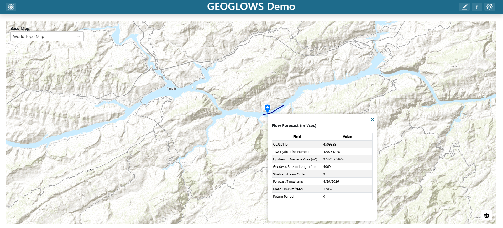

|

Prerequisites
-------------

Before starting you should be comfortable with:

- The TethysDash landing page (see :doc:`../landing_page`)
- Creating and editing dashboard items (see :doc:`../dashboard_editing`)
- Variable inputs (see :doc:`../variable_inputs`)
- Maps (see :doc:`../maps/maps`)

Step 1 — Create the dashboard
-----------------------------

1. From the TethysDash landing page, click **+ Create a New Dashboard**.

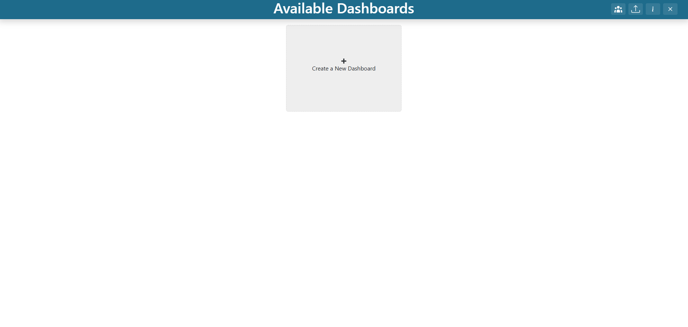

|

2. Enter the following:

   - **Name:** ``GEOGLOWS Demo``
   - **Description:** ``demo``

3. Click **Create**.

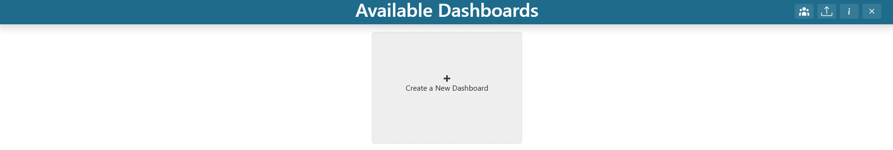

|

4. Double-click the new ``GEOGLOWS Demo`` dashboard card to open it.

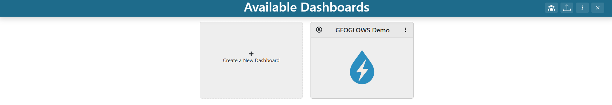

|

You should now be looking at a fresh dashboard containing one default grid item. If the **TethysDash Dashboards** modal appears, dismiss it by checking the "Don't show on startup" option and then pressing the "X" button. You may reopen the modal in the future by pressing the **i** button in the app header.

Step 2 — Edit the existing grid item to be a Map
------------------------------------------------

1. Toggle the dashboard into edit mode by clicking the **pencil / Edit** icon in the toolbar.

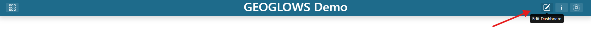

|

2. Find the default grid item and click its three-dot menu.
3. Click **Edit**.

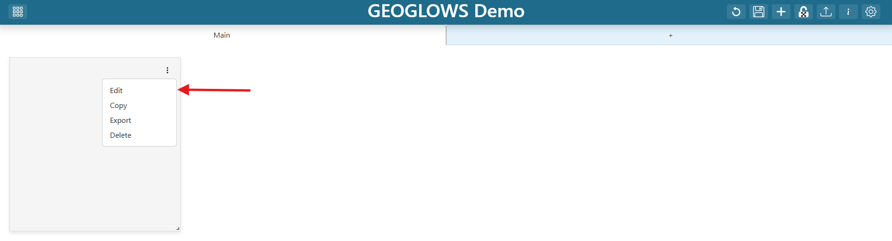

|

4. In the **Visualization Type** dropdown, type ``Map`` and select the Map option under the **Default** section.

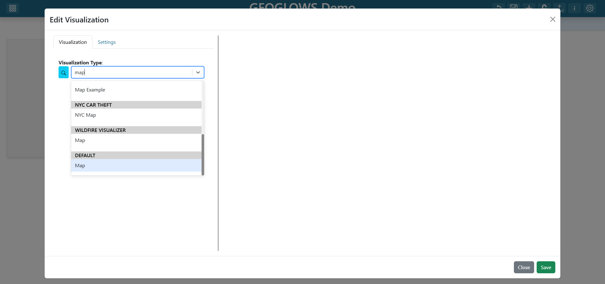

|

5. Select a Base Map for the map (for example, ``World Topo Map``).

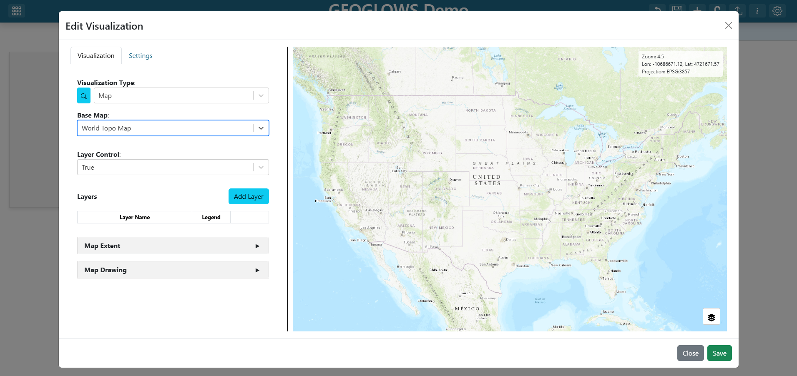

|

.. note::

   See :doc:`../maps/create_map` for the full Map editor reference.

Step 3 — Add the map layer
--------------------------

1. Click **Add Layer**.
2. Configure the new layer as follows:

   - **Name:** ``China Flowlines``
   - **Min Zoom Query:** ``12``

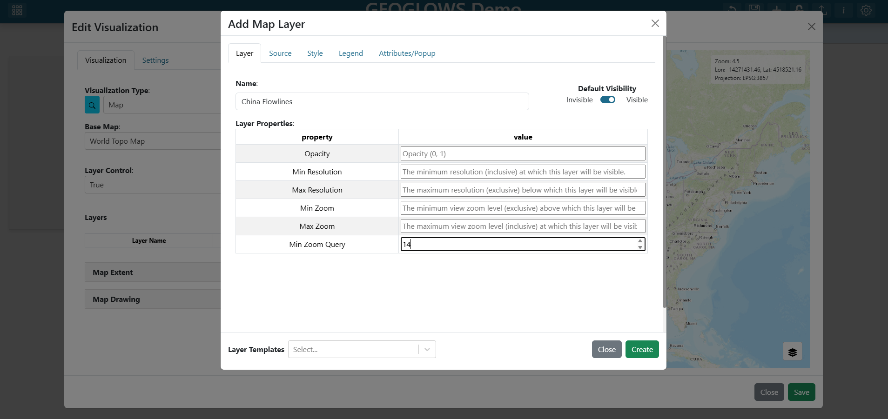

|

.. note::

   **Why** ``Min Zoom Query``\ **?** The GEOGLOWS service has hundreds of thousands of features. Setting a min zoom of ``12`` means popup queries (which fetch attributes for clicked features) only fire once the user has zoomed in far enough that the request is small and fast.

   See the :doc:`../maps/layer_tab` for all layer-level options.

Step 4 — Edit the layer source
------------------------------

1. Click on the **Source** tab in the layer editor.
2. Click on the **Source Type** dropdown and select ``ESRI Image and Map Service``.
3. Fill in the layer properties as follows:

   - **URL:** ``https://livefeeds3.arcgis.com/arcgis/rest/services/GEOGLOWS/GlobalWaterModel_Medium/MapServer``
   - **params - LAYERDEFS:** ``{"0": "rivercountry = 'China'"}``

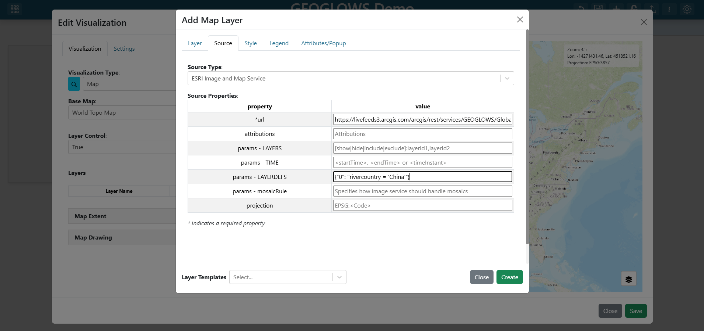

|

.. note::

   **Why** ``params - LAYERDEFS``\ **?** The GEOGLOWS service covers the entire globe. Setting a layer definition query filters the service to only return river segments in China, which is much more performant and relevant for this dashboard. The value must be valid JSON with double quotes, and the layer index (``0``) is required to target the correct sublayer.

   See the :doc:`../maps/source_tab` for every supported source type and its props.

Step 5 — Edit attributes and popup
----------------------------------

GEOGLOWS column names like ``objectid`` and ``shape`` are not user-friendly. Trim the popup so it only shows useful fields by omitting the following from **Attributes/Table Popup**:

- ``objectid``
- ``outletcomid``
- ``region``
- ``vpu``
- ``rivercountry``
- ``outletcountry``
- ``thickness``
- ``shape``

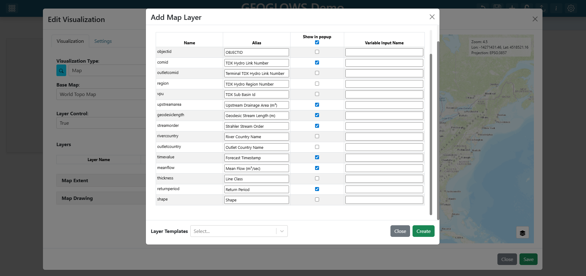

|

.. note::

   See :doc:`../maps/attributes_and_popups_tab` for the full set of aliasing, omission, and click-binding options.

Step 6 — Save the layer
-----------------------

Click **Create** at the bottom of the layer editor. The layer collapses back into the map's layer list and shows as ``China Flowlines``.

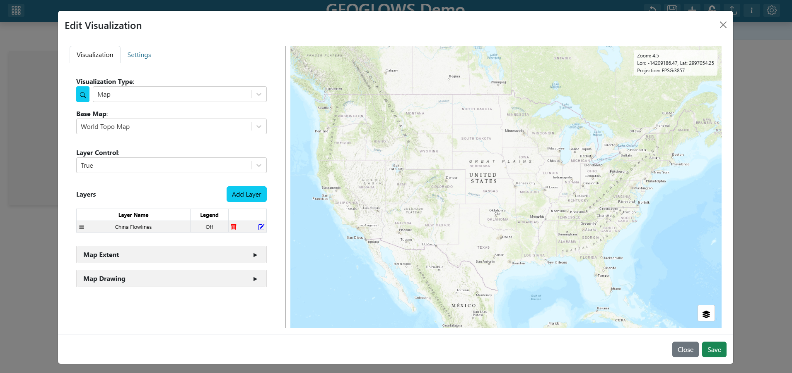

|

Step 7 — Edit the Map Extent
----------------------------

1. Expand the map editor's **Map Extent** section.
2. Select **Use the Previewed Map Extent** option.

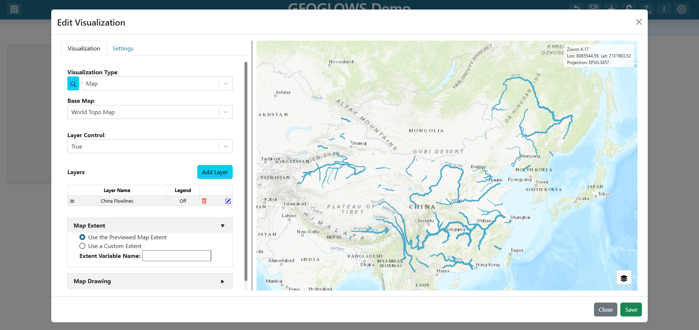

|

Step 8 — Save the map
---------------------

1. Click **Save** at the bottom of the map's grid item editor. The grid item now renders the GEOGLOWS service.
2. Click and drag the map grid item's bottom-right corner to resize it to cover the entire dashboard.

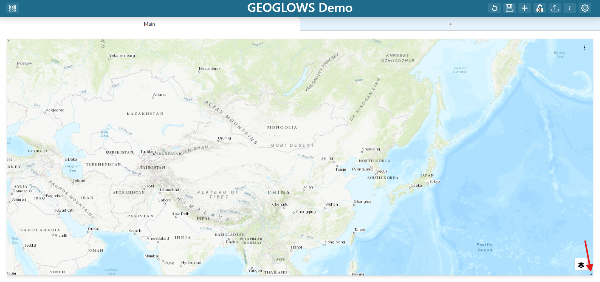

|

Step 9 — Save the dashboard
---------------------------

Click the **Save** (disk) icon in the dashboard toolbar to persist everything you have done so far.

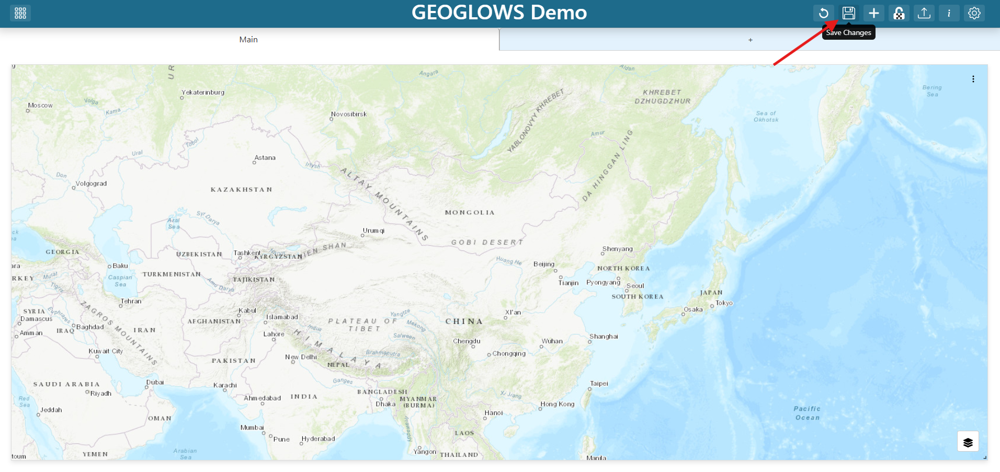

|

Explore the map preview and test that the popups work. Don't worry about the base map yet — you will make that dynamic in the next steps.

Step 10 — Update Dashboard Item Placement Restrictions
------------------------------------------------------

1. Click the dashboard **Settings** (gear) icon in the toolbar.

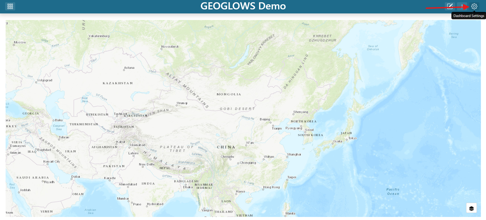

|

2. Scroll to the **Unrestricted Grid Item Placement** section.
3. Select the checkbox for **On**.
4. Click the **Save** (disk) icon at the bottom of the settings pane.
5. Close the settings pane.

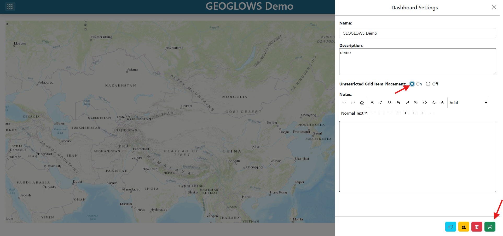

|

.. note::

   See :doc:`../dashboard_settings` for every option in the gear pane.

Step 11 — Re-enter edit mode
----------------------------

Click the **Edit** (pencil) icon to re-enter edit mode. You will now add a Variable Input.

Step 12 — Add a Base Map variable input
---------------------------------------

1. Click **+ (Add Dashboard Item)** in the toolbar.

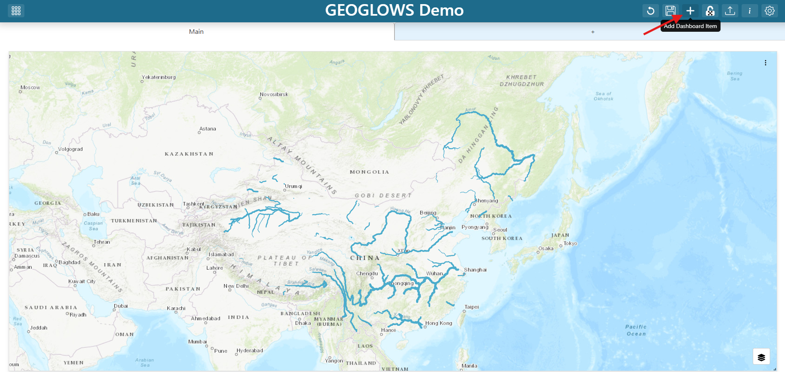

|

2. Find the new grid item and click its three-dot menu.
3. Click **Edit**.

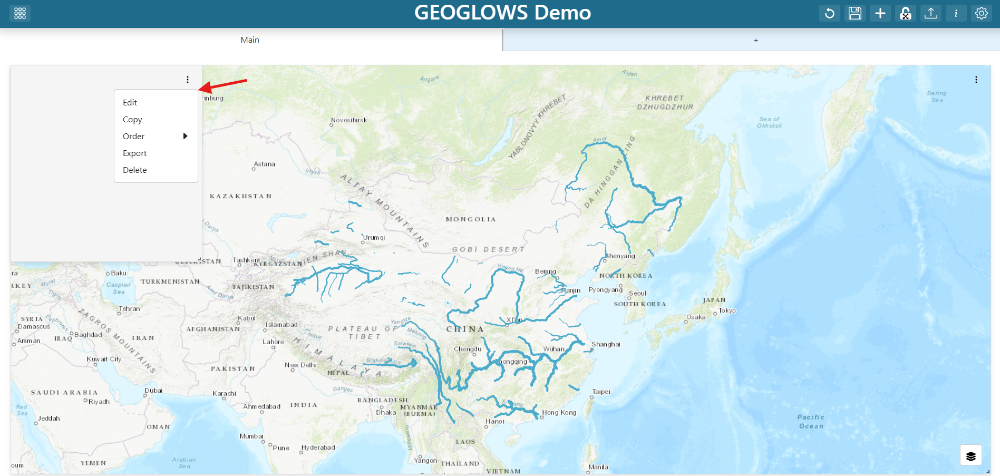

|

4. Set the **Visualization Type** to **Variable Input** under the Default section.
5. Set the variable input's properties as follows:

   - **Variable Name:** ``Base Map``
   - **Show Label:** ``True``
   - **Variable Options Source:** ``Base Map Layers``

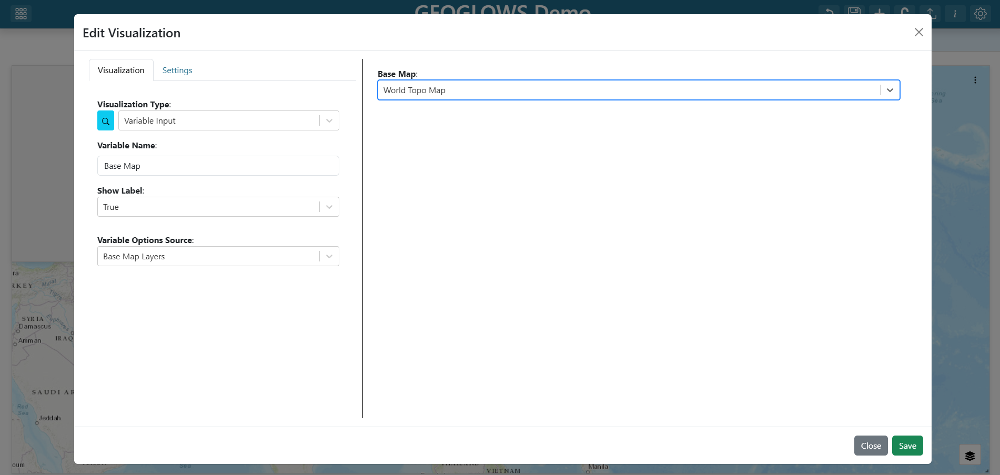

|

.. note::

   ``Base Map Layers`` is a built-in options source that exposes TethysDash's curated list of base map URLs. Using it here means the dropdown is automatically populated with valid base map services.

   See :doc:`../variable_inputs` for all built-in options sources and how to define custom ones.

6. In the variable input editor preview, click the dropdown and select an initial base map (for example, ``World Topo Map``).
7. Click **Save** at the bottom of the variable input editor.
8. Resize and reposition the variable input as you like (for example, top-left corner as a floating item).

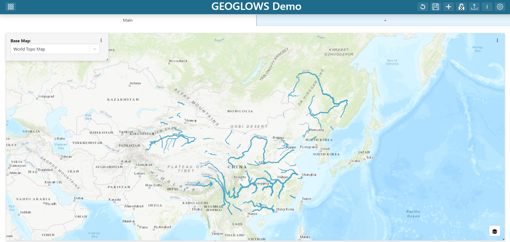

|

Step 13 — Edit the map
----------------------

1. Find the map grid item and click its three-dot menu.
2. Click **Edit**.

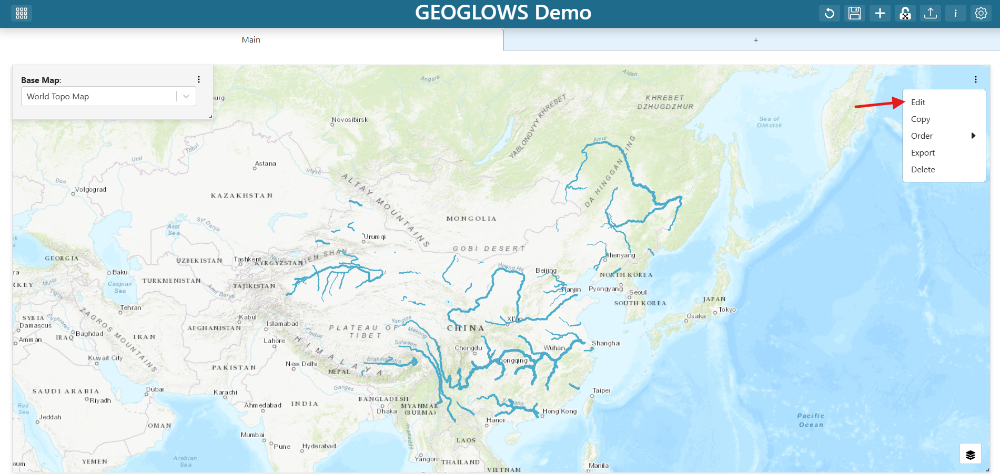

|

Step 14 — Change the base map to reference the variable input
-------------------------------------------------------------

In the map's **Base Map** field, replace whatever value is there with the template reference:

.. code-block:: text

   ${Base Map}

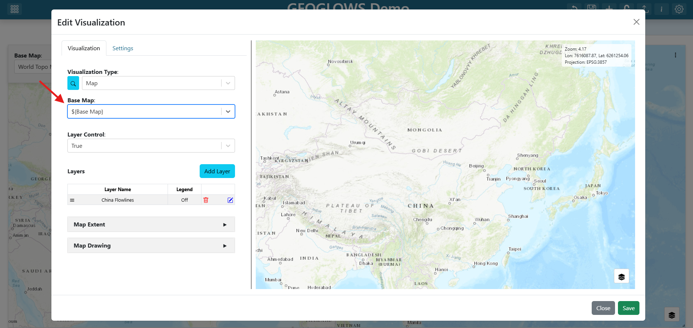

|

The ``${...}`` syntax tells TethysDash to substitute in the current value of the variable input named ``Base Map`` whenever the map renders. Whenever the user picks a different option from the dropdown, the map re-renders with the new base map URL.

.. note::

   See :doc:`../variable_inputs` for the full template-substitution semantics.

Step 15 — Save the map
----------------------

Click **Save** in the map editor.

Step 16 — Save the dashboard
----------------------------

Click the dashboard **Save** (disk) icon in the toolbar once more to persist the variable input, the new base-map binding, and the final layout.

Step 17 — Explore
-----------------

- Change the base map by opening the **Base Map** dropdown and picking a different option (for example, an imagery base map). The base map should switch immediately while the flowlines stay in place.
- Zoom in past zoom level 12 and click a river segment. The popup should show your friendly aliases and hide the omitted fields.
- The map service is finicky when clicking for popups; you may need to zoom in very close to get popups to fire. This is a quirk of the service, not TethysDash, but it is worth being aware of as you test the dashboard.
- Refresh the page. The dashboard should reopen at the China extent you saved, with the topo base map selected by default.

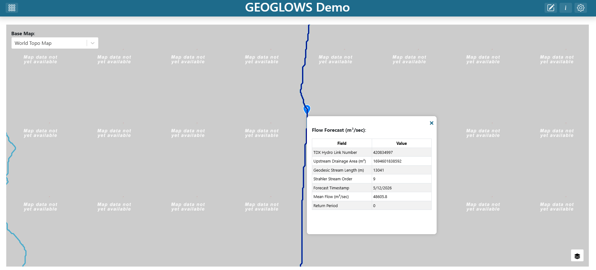

|

Troubleshooting
---------------

- **Flowlines never appear** — Verify the URL is ``https://livefeeds3.arcgis.com/arcgis/rest/services/GEOGLOWS/GlobalWaterModel_Medium/MapServer`` and the ``LAYERDEFS`` parameter is ``{"0": "rivercountry = 'China'"}``. If the layer is misconfigured, the map will load but no flowlines will appear.
- **Base map does not change when the dropdown changes** — Confirm the map's Base Map field is the literal string ``${Base Map}`` (with the same capitalization and spaces as the variable input's name). The substitution is name-sensitive.

Final Solution
--------------

`GEOGLOWS_China_TethysDash.json <https://github.com/tethysplatform/workshop/blob/main/docs/workshop/GEOGLOWS_China_TethysDash.json>`_

.. note::

   This file can be imported into TethysDash via the **Import Dashboard** button on the landing page. Importing it will give you a working dashboard that matches the one you built in this tutorial, which you can then explore and edit as you like.
