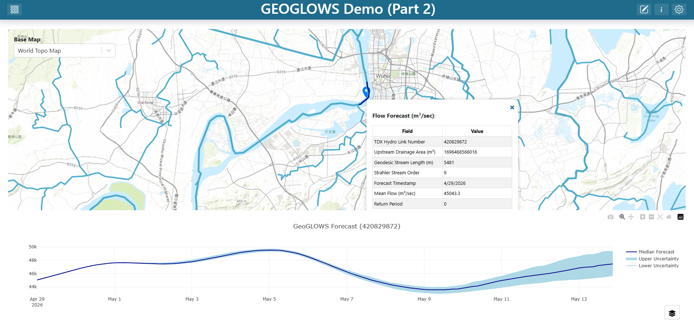
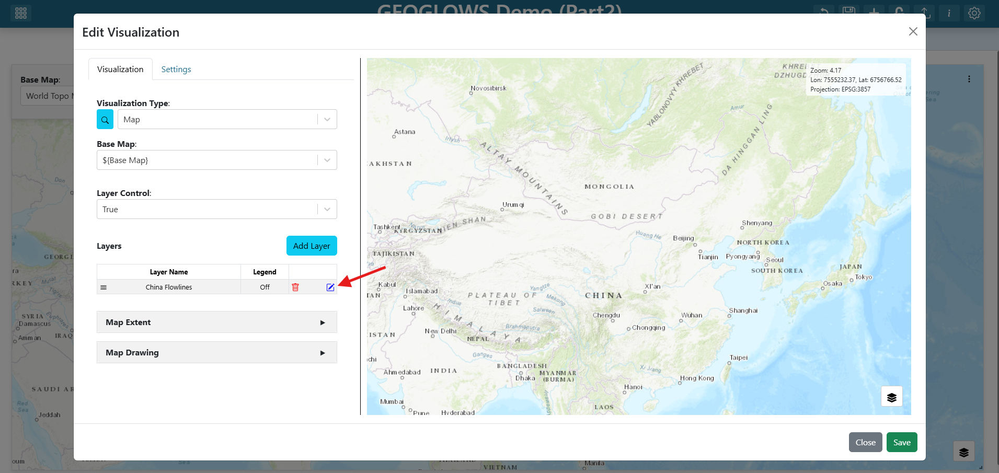
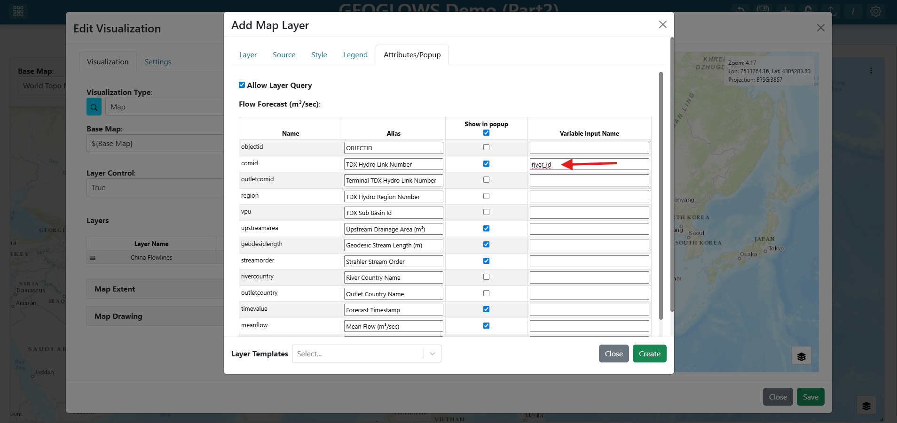
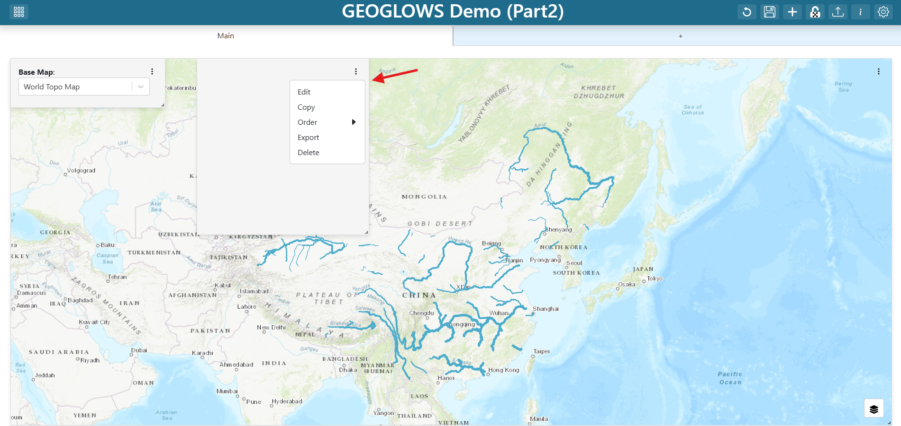
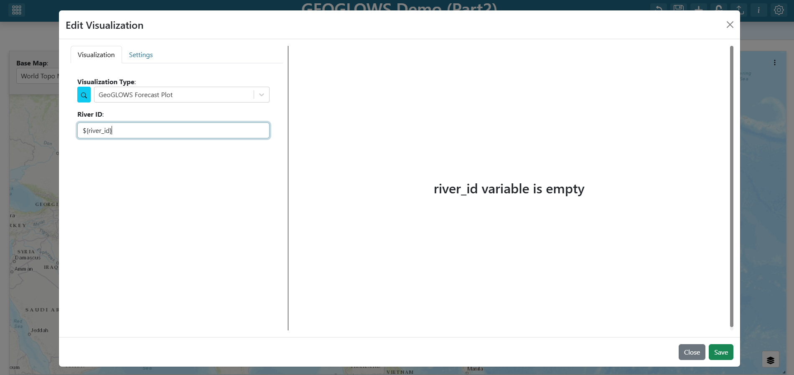
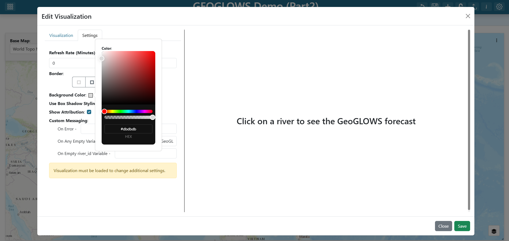
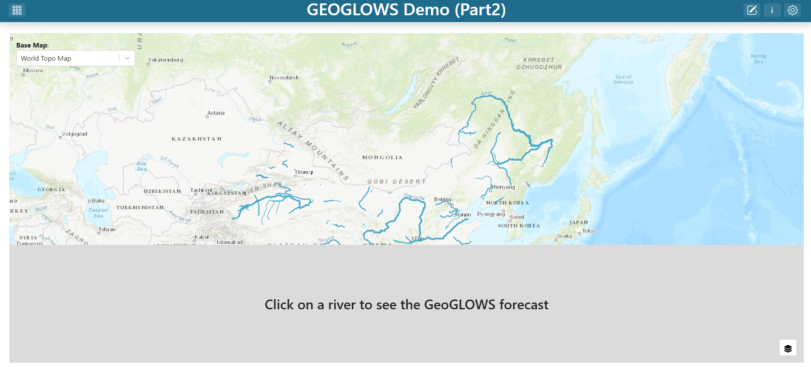
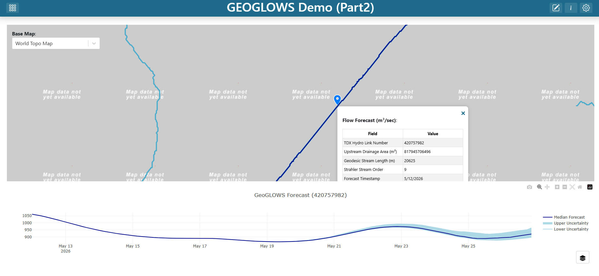

.. _tutorial_geoglows_demo_part2:

GEOGLOWS Demo (Part 2)
======================

This tutorial picks up where :doc:`geoglows_demo` left off. You will extend the dashboard you built in Part 1 by connecting the map's ``comid`` attribute to a new variable input, then adding a GeoGLOWS forecast plot grid item that updates whenever the user clicks a river segment on the map.

For an alternative approach that opens the forecast plot in a floating popup modal instead of a permanent grid item, see :doc:`popup_modal_tutorial`.

**Finished product:** `https://demo.tethysgeoscience.org/apps/tethysdash/dashboard/6a74d783-3885-4c66-8b87-83dbf927d67f <https://demo.tethysgeoscience.org/apps/tethysdash/dashboard/6a74d783-3885-4c66-8b87-83dbf927d67f>`_

|

What you will build
-------------------

- A ``river_id`` variable input that captures the ``comid`` of whichever river segment the user clicks on the map.
- A **GeoGLOWS Forecast Plot** grid item that re-fetches whenever ``river_id`` changes, with a friendly placeholder shown before any river has been selected.

Prerequisites
-------------

- Complete :doc:`geoglows_demo` first. You should have a dashboard named **GEOGLOWS Demo** that contains a Map of Chinese GEOGLOWS flowlines and a **Base Map** variable input.
- A local installation of TethysDash — see :doc:`../installation`.
- The `tethysdash_examples <https://github.com/FIRO-Tethys/tethysdash_examples>`_ plugin package must be installed as a TethysDash dependency. It provides the ``GeoGLOWS Forecast Plot`` visualization used in this tutorial.

Step 1 — Edit the dashboard
---------------------------

Open your **GEOGLOWS Demo** dashboard and click the **Edit** (pencil) icon in the toolbar to enter edit mode.

.. image:: ../../images/tutorials/geoglows_part2/2.1_dashboard_starting_point.png
   :align: center
   :class: tutorial-image

|

Step 2 — Edit the map layer
---------------------------

1. Find the map grid item, click its three-dot menu, and click **Edit**.
2. In the map editor's **Layers** list, click the **China Flowlines** layer to open the layer editor.

|

Step 3 — Connect ``comid`` to a ``river_id`` variable input
-----------------------------------------------------------

1. Switch to the **Attributes/Table Popup** tab in the layer editor.
2. Find the ``comid`` row.
3. Set its **Alias** to ``River ID``.
4. Set its **Variable Input Name** to ``river_id``.

|

.. note::

   Setting a variable input name on an attribute means: whenever a user clicks a feature on the map, that feature's value for this attribute is written to the named variable input. Any visualization that references ``${river_id}`` will then re-fetch with the new value.

   See :doc:`../maps/attributes_and_popups_tab` for the full reference on attribute aliases and click-to-variable bindings.

5. Click **Create** at the bottom of the layer editor.
6. Click **Save** at the bottom of the map editor.

Step 4 — Inspect the GeoGLOWS Forecast Plot plugin
--------------------------------------------------

The visualization you are about to add is provided by a TethysDash *visualization plugin* — an external Python package that subclasses ``TethysDashPlugin`` and is auto-discovered when installed alongside TethysDash. The :doc:`../plugins` page is the full reference for the plugin API: every supported ``type``, every ``args`` field type, ``send_update``, packaging, and discovery.

Here is the full source for the ``GeoGLOWS Forecast Plot`` plugin from the `tethysdash_examples <https://github.com/FIRO-Tethys/tethysdash_examples>`_ repository:

.. code-block:: python

   from tethysapp.tethysdash.plugin_helpers import TethysDashPlugin
   import requests

   class GeoGLOWSForecastPlot(TethysDashPlugin):
       name = "geoglows_forecast_plot"
       group = "Tutorials"
       label = "GeoGLOWS Forecast Plot"
       type = "plotly"
       tags = [
           "example",
           "plotly",
           "tutorial",
           "geoglows",
       ]
       description = "A GeoGLOWS forecast plot for the GeoGLOWS tutorial"
       args = {"river_ID": "number"}

       def run(self):
           self.send_update("Loading forecast data from GeoGLOWS API...")
           url = f"https://geoglows.ecmwf.int/api/v2/forecast/{self.river_ID}?format=json"
           response = requests.get(url)
           forecast_data = response.json()

           self.send_update("Processing forecast data...")
           data = [
               {
                   "type": "scatter",
                   "x": forecast_data["datetime"],
                   "y": forecast_data["flow_uncertainty_lower"],
                   "name": "Lower Uncertainty",
                   "line": {"color": "lightblue"},
               },
               {
                   "type": "scatter",
                   "x": forecast_data["datetime"],
                   "y": forecast_data["flow_uncertainty_upper"],
                   "name": "Upper Uncertainty",
                   "line": {"color": "lightblue"},
                   "fill": "tonexty",
                   "fillcolor": "lightblue",
               },
               {
                   "type": "scatter",
                   "x": forecast_data["datetime"],
                   "y": forecast_data["flow_median"],
                   "name": "Median Forecast",
                   "line": {"color": "darkblue"},
               },
           ]

           layout = {
               "title": f"GeoGLOWS Forecast ({self.river_ID})",
           }

           config = {"displayModeBar": True}

           return {"data": data, "layout": layout, "config": config}

Key things to understand before wiring the plugin into the dashboard:

.. list-table::
   :header-rows: 1
   :widths: 20 25 55

   * - Attribute
     - Value
     - What it means
   * - ``name``
     - ``"geoglows_forecast_plot"``
     - Unique identifier written into the dashboard JSON's ``source`` field
   * - ``label`` / ``group``
     - ``"GeoGLOWS Forecast Plot"`` / ``"Tutorials"``
     - How the plugin appears in the **Visualization Type** dropdown
   * - ``type``
     - ``"plotly"``
     - TethysDash renders ``run()``\ 's return value as a Plotly figure
   * - ``args``
     - ``{"river_ID": "number"}``
     - Declares a single numeric input; TethysDash auto-renders a form field for it

The ``run()`` method fetches the forecast for ``self.river_ID`` from the GeoGLOWS REST API, builds three Plotly traces (lower-uncertainty band, upper-uncertainty band, and median forecast), and returns them in the standard Plotly figure shape. The ``self.send_update(...)`` calls stream progress messages back to the dashboard over WebSocket while ``run()`` is in flight, so the user sees status instead of a silent spinner.

Step 5 — Add a new dashboard item
---------------------------------

Click the **+ (Add Dashboard Item)** icon in the toolbar. A new empty grid item appears on the dashboard.

Step 6 — Configure the GeoGLOWS Forecast Plot
---------------------------------------------

1. Find the new grid item, click its three-dot menu, and click **Edit**.

|

2. Set the **Visualization Type** to ``GeoGLOWS Forecast Plot`` (under the **Tutorials** group).
3. Set the plot's properties:

   - **River ID:** ``${river_id}``

|

The ``${river_id}`` template tells the plot to read from the variable input you connected to the map. When the user clicks a river segment, the plot re-fetches the forecast for that segment's ``comid``.

Step 7 — Configure the plot's settings
--------------------------------------

Until the user clicks a river, ``river_id`` has no value. Configure a friendly placeholder so the plot does not look broken, and set a background color so the plot stands out from the map.

1. Switch to the **Settings** tab in the visualization editor.
2. Under **On Any Empty Variable**, enter: ``Click on a river to see the GeoGLOWS forecast``
3. Set the **Background Color** to ``#dbdbdb`` (light grey).

|

.. note::

   See :doc:`../dashboard_visualizations` for every option in the visualization Settings tab.

Step 8 — Save the item
----------------------

Click **Save** at the bottom of the visualization editor. The new grid item now renders the placeholder message.

Step 9 — Resize and place the plot
----------------------------------

Drag the bottom-right corner of the new grid item to resize it. A common layout is to place the plot below the map spanning the full dashboard width so the forecast is easy to read at a glance.

|

Step 10 — Save the dashboard
----------------------------

Click the dashboard **Save** (disk) icon in the toolbar to persist your changes.

Try it out
----------

Exit edit mode and zoom in on the map past zoom 12 until the flowlines render. Click any river segment in China — the GeoGLOWS Forecast Plot grid item should immediately re-render with the forecast for that ``comid``. Click a different segment and the plot updates again.

|

Final Solution
--------------

`GEOGLOWS_China_TethysDash_Part2.json <https://github.com/tethysplatform/workshop/blob/main/docs/workshop/GEOGLOWS_China_TethysDash_Part2.json>`_

.. note::

   This file can be imported into TethysDash via the **Import Dashboard** button on the landing page. Importing it will give you a working dashboard that matches the one you built in this tutorial, which you can then explore and edit as you like.
