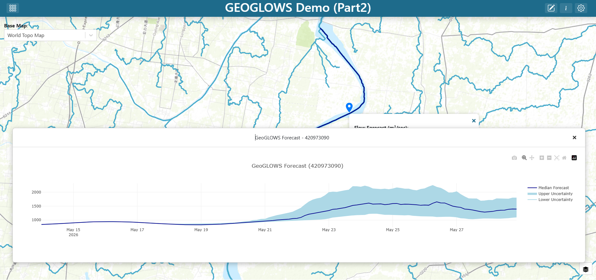
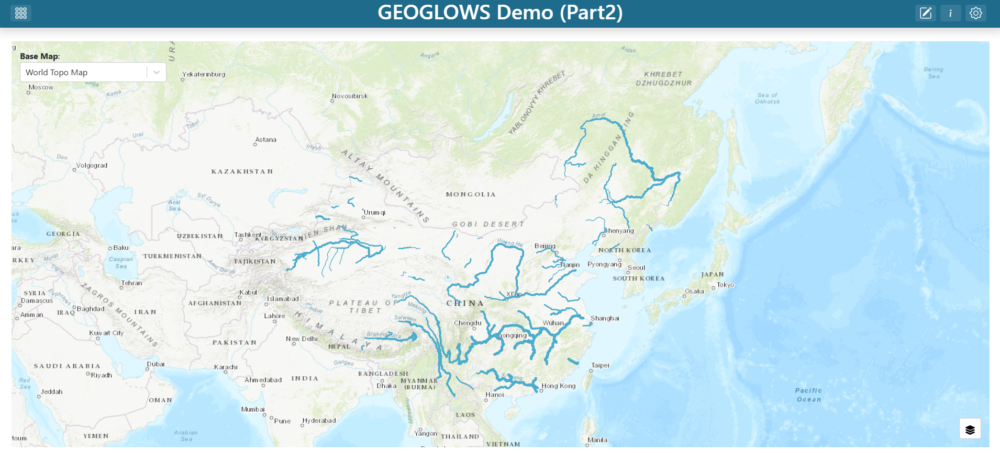
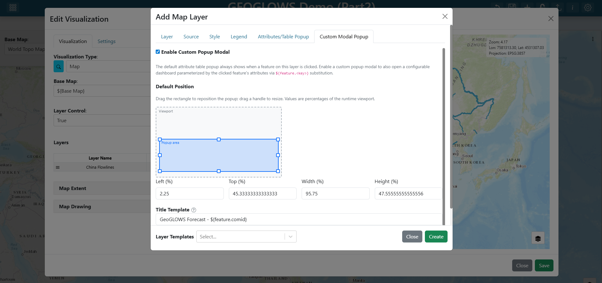
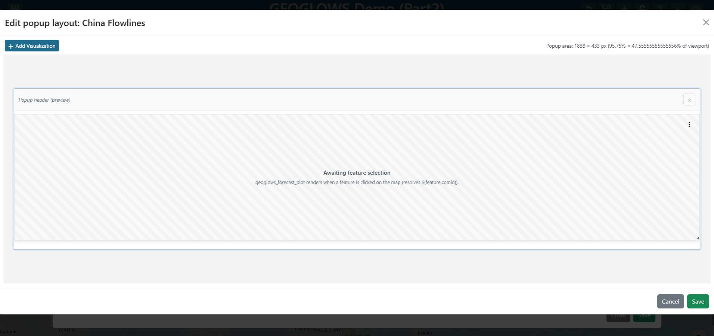

.. _tutorial_popup_modal:

Custom Popup Modal (GEOGLOWS Forecast)
======================================

This tutorial is an alternative ending to :doc:`geoglows_demo`. Instead of adding a GeoGLOWS forecast plot as a permanent grid item on the dashboard (which is what :doc:`geoglows_demo_part2` does), you will surface the forecast as a **floating popup modal** that opens only when the user clicks a river segment on the map.

Floating popup modals are useful when you want contextual information to appear *on demand* without taking up permanent dashboard real estate.

**Finished product:** `https://demo.tethysgeoscience.org/apps/tethysdash/dashboard/3367ea97-2895-4355-a513-b452d21e4bf9 <https://demo.tethysgeoscience.org/apps/tethysdash/dashboard/3367ea97-2895-4355-a513-b452d21e4bf9>`_

|

What you will build
-------------------

- A **Custom Popup Modal** on the China Flowlines layer that opens whenever a user clicks a river segment.
- A **GeoGLOWS Forecast Plot** inside the popup, parameterized by the clicked feature's ``comid`` via the ``${feature.<key>}`` template syntax.

Prerequisites
-------------

- Complete :doc:`geoglows_demo` first. You should have a dashboard named **GEOGLOWS Demo** that contains a Map of Chinese GEOGLOWS flowlines and a **Base Map** variable input.
- A local installation of TethysDash — see :doc:`../installation`.
- The `tethysdash_examples <https://github.com/FIRO-Tethys/tethysdash_examples>`_ plugin package must be installed as a TethysDash dependency. It provides the ``GeoGLOWS Forecast Plot`` visualization used in this tutorial.
- Familiarity with the :ref:`popup_modal` reference page is helpful but not required — every concept the tutorial uses is also explained here.

Step 1 — Edit the dashboard
---------------------------

Open your **GEOGLOWS Demo** dashboard and click the **Edit** (pencil) icon in the toolbar to enter edit mode.

|

Step 2 — Edit the map layer
---------------------------

1. Find the map grid item, click its three-dot menu, and click **Edit**.
2. In the map editor's **Layers** list, click the **China Flowlines** layer to open the layer editor.

.. image:: ../../images/tutorials/popup_modal/2.2_edit_layer.png
   :align: center
   :class: tutorial-image

|

Step 3 — (Optional) Alias the ``comid`` attribute
-------------------------------------------------

1. Switch to the **Attributes/Table Popup** tab in the layer editor.
2. Find the ``comid`` row.
3. Set its **Alias** to ``River ID``.

.. image:: ../../images/tutorials/popup_modal/2.3_update_attribute_variable.png
   :align: center
   :class: tutorial-image

|

.. note::

   The popup modal references the clicked feature's attributes directly via ``${feature.comid}``, so a variable input binding is **not** required for this approach (unlike :doc:`geoglows_demo_part2`, which uses a ``${river_id}`` variable input). Aliasing is purely cosmetic here — it just makes the field show up as **River ID** in the default attribute table popup that appears alongside the modal.

   See :doc:`../maps/attributes_and_popups_tab` for the full reference on attribute aliases.

Step 4 — Inspect the GeoGLOWS Forecast Plot plugin
--------------------------------------------------

The visualization you are about to add is provided by a TethysDash *visualization plugin* — an external Python package that subclasses ``TethysDashPlugin`` and is auto-discovered when installed alongside TethysDash. The :doc:`../plugins` page is the full reference for the plugin API: every supported ``type``, every ``args`` field type, ``send_update``, packaging, and discovery.

Here is the full source for the ``GeoGLOWS Forecast Plot`` plugin from the `tethysdash_examples <https://github.com/FIRO-Tethys/tethysdash_examples>`_ repository:

.. code-block:: python

   from tethysapp.tethysdash.plugin_helpers import TethysDashPlugin
   import requests

   class GeoGLOWSForecastPlot(TethysDashPlugin):
       name = "geoglows_forecast_plot"
       group = "Tutorials"
       label = "GeoGLOWS Forecast Plot"
       type = "plotly"
       tags = [
           "example",
           "plotly",
           "tutorial",
           "geoglows",
       ]
       description = "A GeoGLOWS forecast plot for the GeoGLOWS tutorial"
       args = {"river_ID": "number"}

       def run(self):
           self.send_update("Loading forecast data from GeoGLOWS API...")
           url = f"https://geoglows.ecmwf.int/api/v2/forecast/{self.river_ID}?format=json"
           response = requests.get(url)
           forecast_data = response.json()

           self.send_update("Processing forecast data...")
           data = [
               {
                   "type": "scatter",
                   "x": forecast_data["datetime"],
                   "y": forecast_data["flow_uncertainty_lower"],
                   "name": "Lower Uncertainty",
                   "line": {"color": "lightblue"},
               },
               {
                   "type": "scatter",
                   "x": forecast_data["datetime"],
                   "y": forecast_data["flow_uncertainty_upper"],
                   "name": "Upper Uncertainty",
                   "line": {"color": "lightblue"},
                   "fill": "tonexty",
                   "fillcolor": "lightblue",
               },
               {
                   "type": "scatter",
                   "x": forecast_data["datetime"],
                   "y": forecast_data["flow_median"],
                   "name": "Median Forecast",
                   "line": {"color": "darkblue"},
               },
           ]

           layout = {
               "title": f"GeoGLOWS Forecast ({self.river_ID})",
           }

           config = {"displayModeBar": True}

           return {"data": data, "layout": layout, "config": config}

Key things to understand before wiring the plugin into the popup:

.. list-table::
   :header-rows: 1
   :widths: 20 25 55

   * - Attribute
     - Value
     - What it means
   * - ``name``
     - ``"geoglows_forecast_plot"``
     - Unique identifier written into the dashboard JSON's ``source`` field
   * - ``label`` / ``group``
     - ``"GeoGLOWS Forecast Plot"`` / ``"Tutorials"``
     - How the plugin appears in the **Visualization Type** dropdown
   * - ``type``
     - ``"plotly"``
     - TethysDash renders ``run()``\ 's return value as a Plotly figure
   * - ``args``
     - ``{"river_ID": "number"}``
     - Declares a single numeric input; TethysDash auto-renders a form field for it

The ``run()`` method fetches the forecast for ``self.river_ID`` from the GeoGLOWS REST API, builds three Plotly traces (lower-uncertainty band, upper-uncertainty band, and median forecast), and returns them in the standard Plotly figure shape. The ``self.send_update(...)`` calls stream progress messages back to the dashboard over WebSocket while ``run()`` is in flight, so the user sees status instead of a silent spinner.

Step 5 — Enable Custom Popup Modal on the layer
-----------------------------------------------

1. Switch to the **Custom Modal Popup** tab in the layer editor.
2. Check the **Enable Custom Popup Modal** checkbox.
3. Set the **Title Template** to:

   .. code-block:: text

      GeoGLOWS Forecast — ${feature.comid}

   The ``${feature.comid}`` token is replaced at runtime with the ``comid`` of whichever river segment the user clicked.

4. Leave the **Default Position** at the default (60 × 60%, centered) or drag the canvas rectangle to reposition and resize the modal.

|

.. note::

   Enabling the custom popup modal does **not** turn off the default attribute table popup. When a user clicks a feature, both popups appear — the small table popup anchored to the click point, and the floating modal you are about to configure.

   See :ref:`popup_modal` for the full reference on the Custom Modal Popup tab.

Step 6 — Add the forecast plot to the popup layout
--------------------------------------------------

Click **Edit popup layout**. A mini-dashboard editor opens — this is the content that appears inside the modal when the user clicks a river.

1. Click **+ (Add Visualization)** in the mini-dashboard toolbar.
2. Find the new grid item, click its three-dot menu, and click **Edit**.
3. Set the **Visualization Type** to ``GeoGLOWS Forecast Plot`` (under the **Tutorials** group).
4. Set the plot's properties:

   - **River ID:** ``${feature.comid}``

.. note::

   Inside the popup layout, use ``${feature.<key>}`` to reference the clicked feature's attributes. This is **different** from the ``${river_id}`` variable input substitution used on the main dashboard in :doc:`geoglows_demo_part2`. ``${feature.comid}`` resolves to the ``comid`` of whichever river segment was clicked, scoped only to the popup — it does not write to or read from any dashboard variable input.

5. Click **Save** on the visualization editor.
6. Resize the plot grid item to fill the popup area.

|

7. Click **Save** to close the popup layout editor.

Step 7 — Save the layer and map
-------------------------------

1. Click **Create** at the bottom of the layer editor.
2. Click **Save** at the bottom of the map editor.

Step 8 — Save the dashboard
---------------------------

Click the dashboard **Save** (disk) icon in the toolbar to persist your changes.

Try it out
----------

Exit edit mode and zoom in on the map past zoom 12 until the flowlines render. Click any river segment in China — a floating popup modal should appear over the map showing the GeoGLOWS forecast for that segment's ``comid``, with the title ``GeoGLOWS Forecast — <comid>``.

Close the modal with the **×** button or by pressing **Esc**, then click a different segment to confirm the title and chart update for the new feature.

|

Next steps
----------

- Add more visualizations to the popup layout — for example, a text panel with ``${feature.streamorde}`` or an image lookup driven by the clicked feature's attributes. Every tile inside the popup can reference the active feature's attributes via ``${feature.<key>}``.
- Adjust the modal's **Default Position** (Left / Top / Width / Height percentages) to better suit your screen size and layout.
- See :ref:`popup_modal` for the full reference on the Custom Modal Popup tab, including multi-feature carousel behavior when a click hits multiple features at once.
