.. _tutorial_rfc_max_stage_analysis:

RFC Max Stage Analysis
======================

This tutorial walks through building a complete dashboard that combines a map of river gauges with dynamic time series and impact statements. Selecting a gauge on the map updates every other visualization on the dashboard — a common pattern for water-management dashboards that pull together data from multiple sources.

**Finished product:** `demo.firo.aquaveo.com/apps/tethysdash/dashboard/07b80e6d-854b-4ca5-ae02-85fad139ee34 <https://demo.firo.aquaveo.com/apps/tethysdash/dashboard/07b80e6d-854b-4ca5-ae02-85fad139ee34>`_

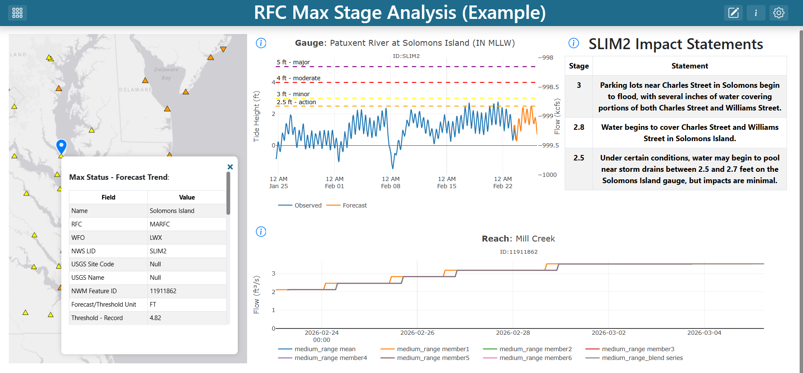

|

What you will build
-------------------

A single dashboard containing:

- A **map** of RFC maximum-forecast gauges
- A **gauge time series** hydrograph tied to the gauge selected on the map
- **Impact statements** describing what each water level means at the selected gauge
- A **streamflow forecast** (NWMP Reaches Time Series) for the reach associated with the selected gauge
- Two **variable inputs** (``LID`` and ``Feature``) that connect the map to the other visualizations

Prerequisites
-------------

Before starting you should be comfortable with:

- The TethysDash landing page (see :doc:`../landing_page`)
- Creating and editing dashboard items (see :doc:`../dashboard_editing`)
- Variable inputs (see :doc:`../variable_inputs`)
- Maps (see :doc:`../maps/maps`)

You must also have the following plugin packages installed as TethysDash dependencies:

- `ciroh_plugins <https://github.com/FIRO-Tethys/ciroh_plugins>`_ — provides the ``NWMP Gauges Time Series`` and ``NWMP Reaches Time Series`` visualizations
- `tethysdash_plugin_cnrfc <https://github.com/FIRO-Tethys/tethysdash_plugin_cnrfc>`_ — provides the ``Impact Statements`` visualization

Step 1 — Create the dashboard
-----------------------------

From the TethysDash landing page, create a new dashboard named **"RFC Max Stage Analysis"** and give it a short description. Open it, then click **Edit Dashboard** in the upper-right corner to enter edit mode.

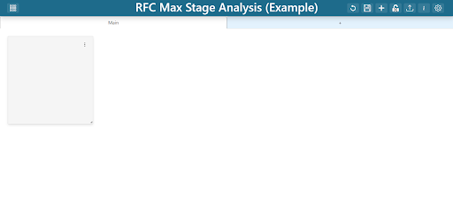

|

Step 2 — Add the RFC Max Forecast map
-------------------------------------

An empty dashboard item appears when you enter edit mode. Click the three dots on the item to open its editor, then configure it as a map:

1. **Visualization Type:** ``Map``
2. **Base Map:** ``World Light Gray Base``
3. **Layer Control:** ``False`` (users won't toggle layers)

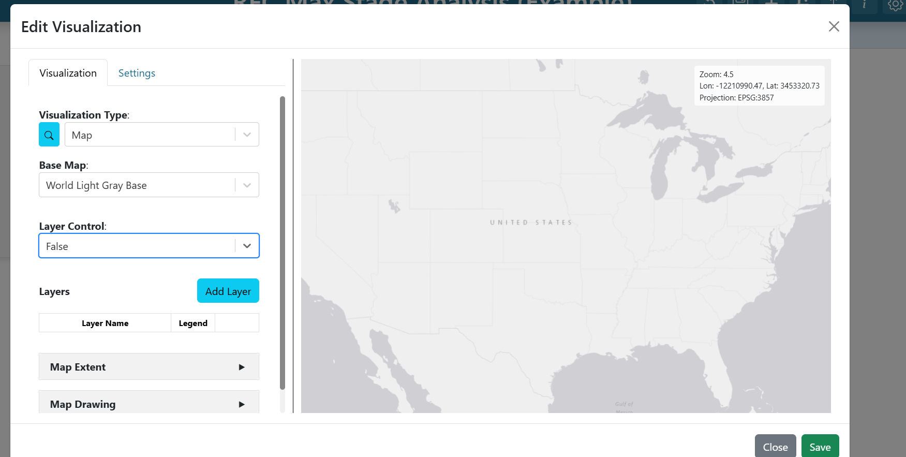

|

Click **Add Layer** and configure the new layer:

- **Name:** ``RFC Max Forecast``
- **Default visibility:** visible
- **Source tab → Source:** ``ESRI Image and Map Service``
- **URL:** ``https://maps.water.noaa.gov/server/rest/services/rfc/rfc_max_forecast/MapServer``

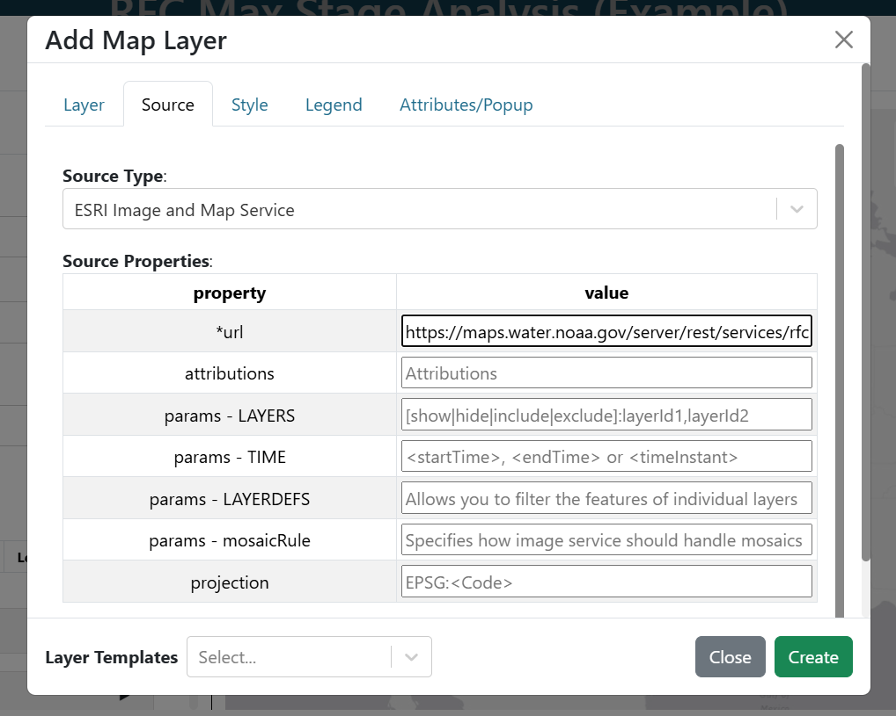

|

Skip the *Style* and *Legends* tabs. On the **Attributes/Popup** tab the attribute list is auto-populated — leave the defaults for now; you will come back here to add variable inputs in later steps. Click **Create** to finish the layer.

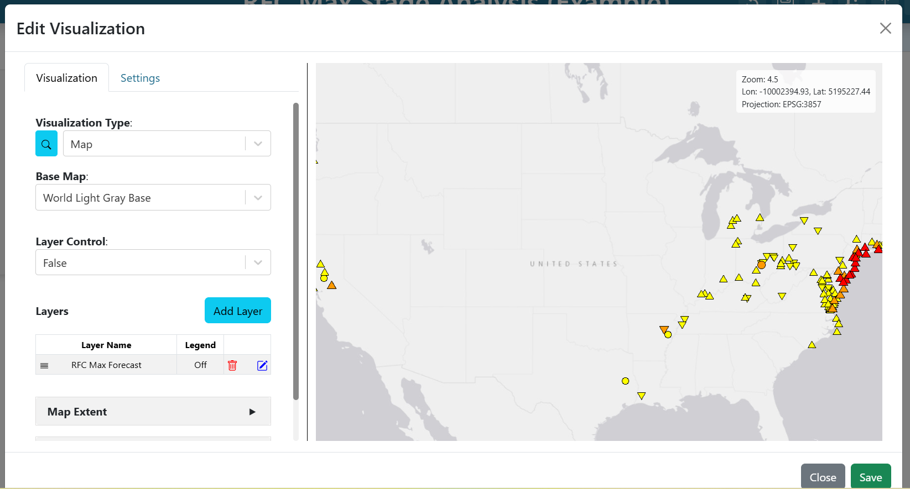

|

Zoom into Maryland, then expand **Map Extent** and choose **Use the Previewed Map Extent** to save the current view as the default.

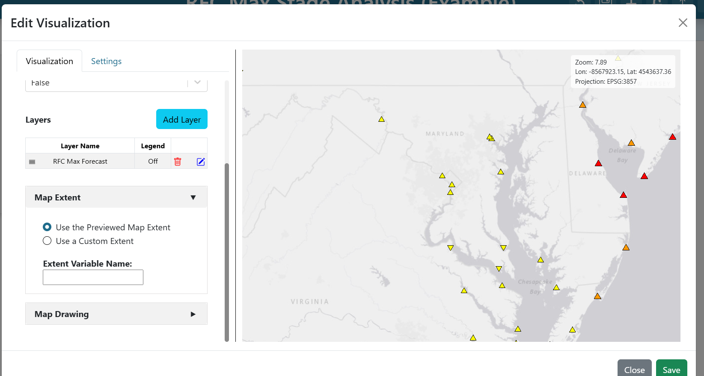

|

Click **Save** on the map editor, resize the map to fill the left third of the dashboard, and save the dashboard to preserve your progress.

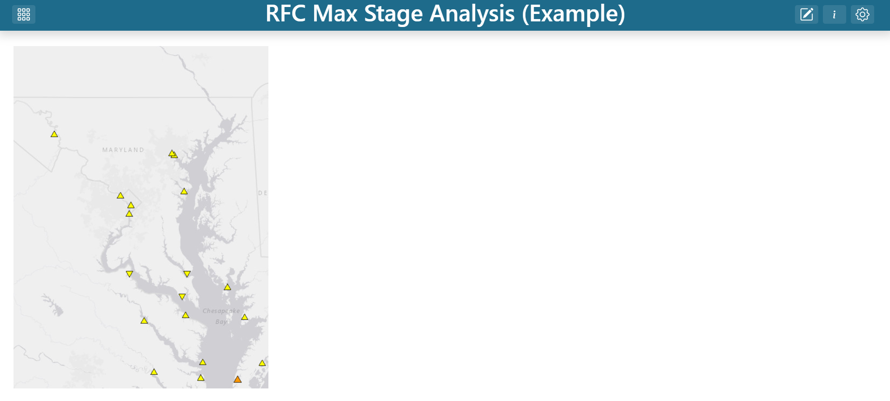

|

Step 3 — Create the ``LID`` variable input
------------------------------------------

The gauge time series and impact statements both need a gauge identifier. Rather than hard-coding one, connect them to the map via a variable input.

Re-enter edit mode, open the map, and edit the **RFC Max Forecast** layer. On the **Attributes/Popup** tab, find the ``nws_lid`` row and set its **Variable Input Name** to ``LID``. Whatever gauge a user clicks on the map, its ``nws_lid`` value now becomes the value of the ``LID`` variable input.

.. image:: ../../images/tutorials/rfc_max_stage/07_lid_variable_input.png
   :align: center
   :class: tutorial-image

|

Save the layer and the map.

Step 4 — Add the gauge hydrograph
---------------------------------

Add a new dashboard item and edit it:

1. **Visualization Type:** ``NWMP Gauges Time Series``
2. **Id:** ``${LID}``

The ``${LID}`` template tells the visualization to read from the variable input you just created. When the user clicks a gauge on the map, the chart automatically re-fetches.

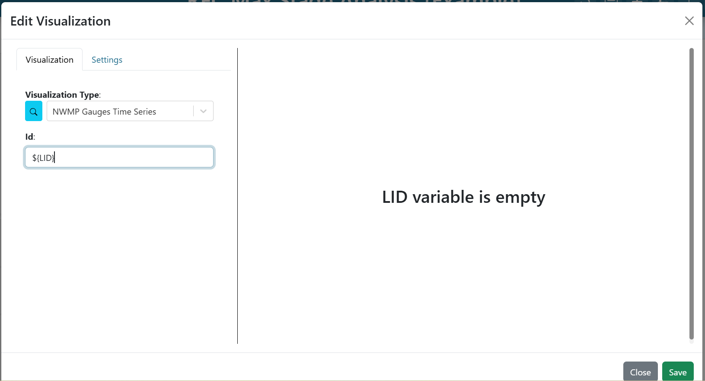

|

Switch to the **Settings** tab. Under **On Empty LID Variable**, enter ``Select a gauge on the map to see the stage hydrograph``. This message will show whenever no gauge has been selected yet, so users know what to do.

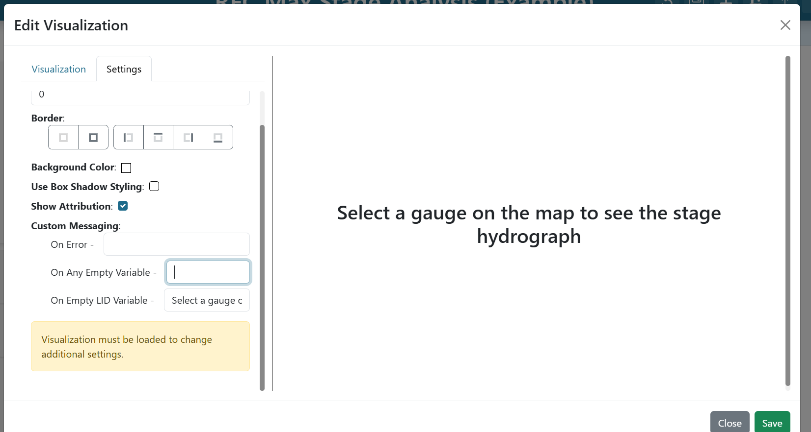

|

Click **Save**.

Step 5 — Add impact statements
------------------------------

Impact statements describe what different water levels mean in plain language. They use the same gauge ID, so you can connect them to the same variable input.

Add another dashboard item:

1. **Visualization Type:** ``Impact Statements``
2. **Gauge Location:** ``${LID}``

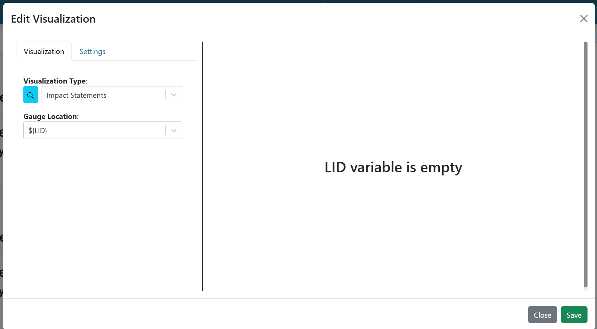

|

On the **Settings** tab, set **On Empty LID Variable** to ``Select a gauge to see impact statements``.

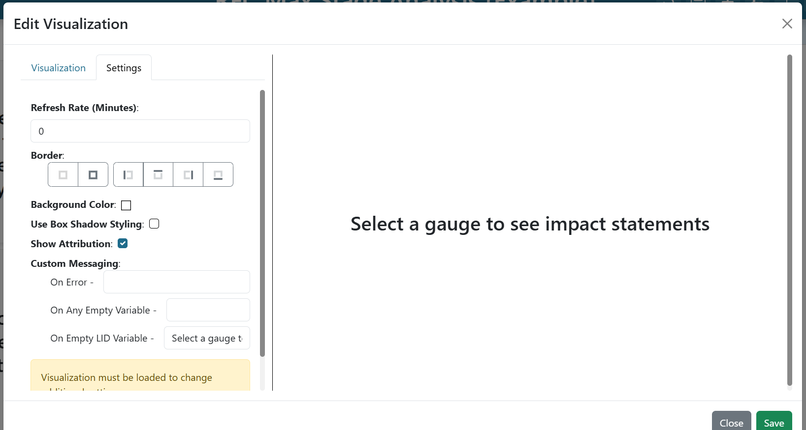

|

Click **Save**.

Step 6 — Add the streamflow forecast
------------------------------------

The NWMP Reaches Time Series uses a different identifier — the ``feature_id`` (a NWM reach ID), not the gauge LID. You need a second variable input for that.

Go back into the map and edit the **RFC Max Forecast** layer once more. On the **Attributes/Popup** tab, find the ``feature_id`` row and set its **Variable Input Name** to ``Feature``. Save the layer and the map.

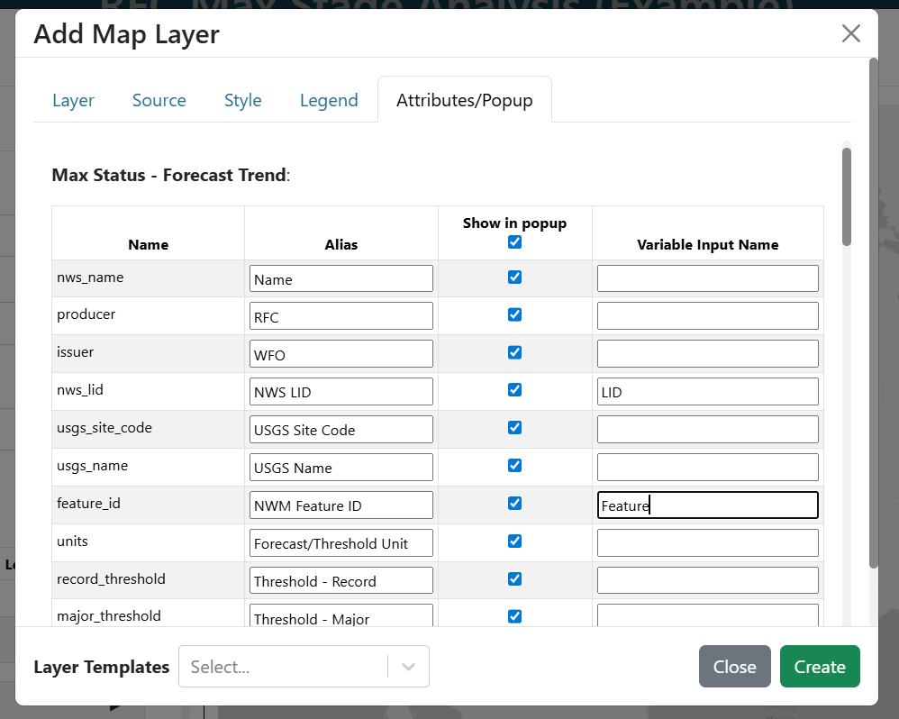

|

Add a new dashboard item:

1. **Visualization Type:** ``NWMP Reaches Time Series``
2. **Id:** ``${Feature}``

On the **Settings** tab, set **On Empty Feature Variable** to ``Select a gauge on the map to see the NWM forecast``.

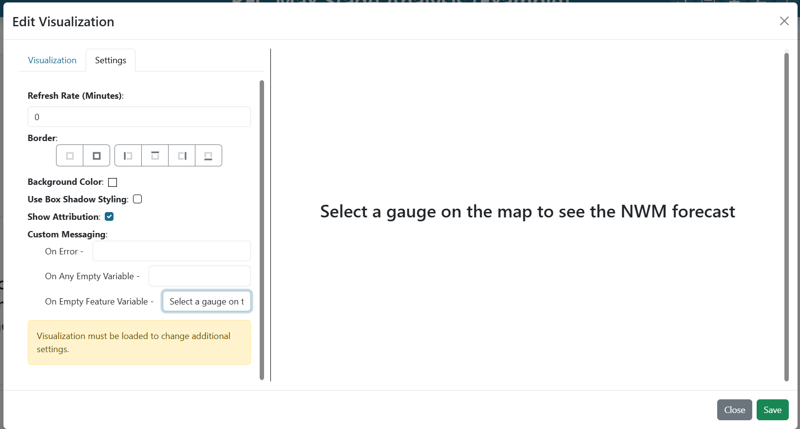

|

Click **Save**, then save the dashboard.

Step 7 — Arrange the layout
---------------------------

Re-enter edit mode and drag/resize each item until everything is visible at once — typically with the map on the left and the three time series / impact items stacked on the right. Save the dashboard.

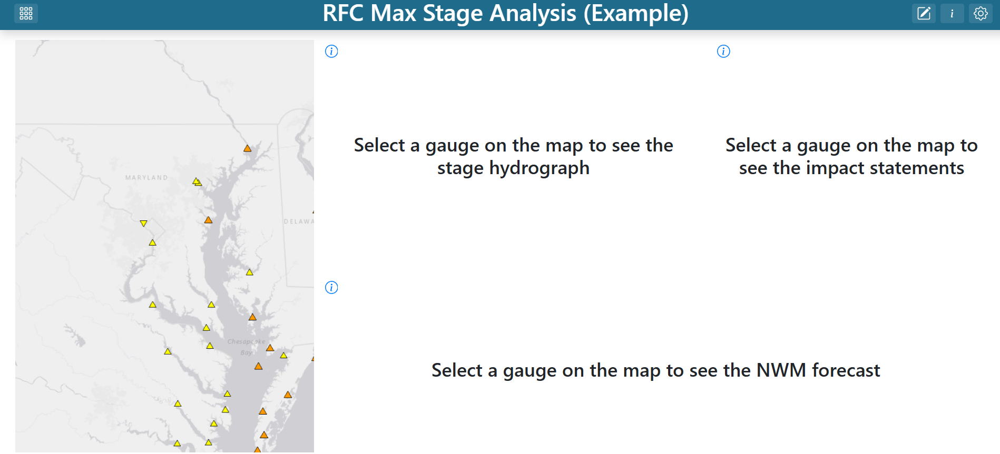

|

Try it out
----------

Click any gauge on the map. The hydrograph, impact statements, and streamflow forecast all update to match the selection — because the ``LID`` and ``Feature`` variable inputs tie them back to the attributes of whatever the user clicked.

|

From here you can extend the dashboard with precipitation forecasts, atmospheric river tracking, or any other visualization that keys off a ``LID`` or ``Feature`` value.
