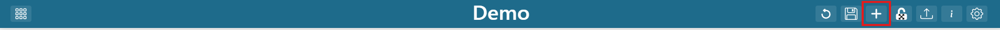
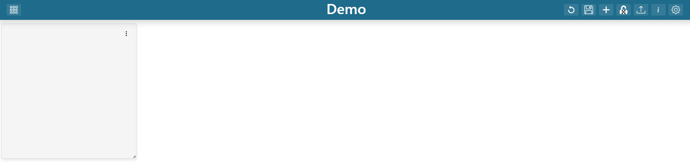

.. _add_dashboard_items:

Adding New Items
----------------

Once in edit mode, Click on the "Add Dashboard Item" (|dashboard_add_item_button|) button in the 
application header.

|

Once clicked a new dashboard item will appear at the top left corner of the dashboard.

|
