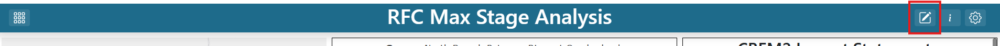

.. _edit_dashboard_items:

Edit Dashboard Items
--------------------

Users can edit dashboards they created, as well as any dashboards where they have been granted editor or admin access. Once such a dashboard is selected, 
click on the |dashboard_edit_button| button in the right side of the app header to turn 
on edit mode. Once in edit mode, additional buttons for reverting changes, saving changes, and adding new 
dashboard items will appear.

|

.. toctree::
   :maxdepth: 1

   add_dashboard_items
   move_resize_dashboard_items
   edit_dashboard_item_visualizations
   copy_dashboard_items
   delete_dashboard_items
   save_dashboard_items
   revert_dashboard_items
   adding_tabs