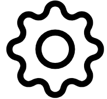

.. _edit_dashboard_settings:

Edit Dashboard Settings
-----------------------

When a dashboard is selected in the dashboard dropdown, a settings (|dashboard_settings_button|) button will appear 
in the app header. Click on the settings button to open up the dashboard settings menu. If the 
selected dashboard was created by the user, then all settings can be changed and saved.

====
Name
====

Indicates the dashboard name. This is the text that will appear in the url for a public dashboard. Dashboard names can 
only be letters and numbers and cannot include any special characters.

Users cannot create multiple dashboards of their own with the same name. A dashboard with the same name as a public 
dashboard can be created but it cannot be made public with that same name.

===========
Description
===========

Indicates the dashboard description. This is the text that will appear when hovering over the dashboard card in the 
landing page of the application. 

================================
Unrestricted Grid Item Placement
================================

Indicates if the dashboard items can be placed anywhere in the dashboard, including overlapping. 

=====
Notes
=====

Users can write, save, and edit notes for the dashboard. For public dashboards, these notes can be seen by anyone 
that accesses the dashboard.

=======================================
Sharing, Copying or Deleting Dashboard
=======================================
At the bottom of the dashboard settings panel are options to copy, manage dashboard permissions or delete the dashboard. More details follow are on the following pages.

=========================
Saving Dashboard Settings
=========================

To persist any setting changes, click on the "Save changes" button on the bottom of the dashboard settings panel.