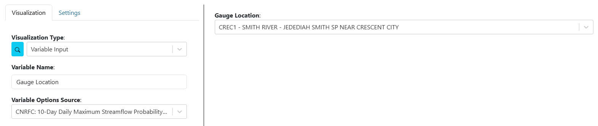

.. _variableinputs:

Variable Inputs
===============

Variable inputs make dashboards more dynamic and interactive. Instead of creating multiple dashboards to view similar visualizations with different arguments, users can use variable inputs to change visualizations on the fly within a single dashboard.

For example, instead of creating three separate dashboards to analyze data for three different gauge locations, you can create one dashboard with visualizations linked to a variable input dropdown. When the user updates the dropdown, all connected visualizations automatically update to reflect the new selection.

.. video:: ../videos/variable_input_example.mp4
    :autoplay:
    :loop:
    :class: variable-input-video

|

Setup
-----

To set up a variable input:

1. Edit the visualization for a dashboard item. (See :doc:`dashboard_editing` for details.)
2. For "Visualization Type," select "Variable Input."
3. Set the "Variable Name" (label/name of the variable).
4. For "Variable Options Source," choose from several input types:

   - **text:** Creates a text input with a refresh button.
   - **number:** Creates a number input with a refresh button.
   - **checkbox:** Creates a checkbox input.
   - **date:** Creates a date picker input with a refresh button. Set a default by selecting a date. You can also type relative date math (``now``, ``now-7D``, ``now+30D``) or the preset ``latest`` directly into the field; ``latest`` always resolves to the newest available data for connected visualizations.
   - **dropdown:** Creates a dropdown input. Set the choices by entering values and pressing Add. Set a default by selecting a value.
   - **date-range:** Creates a date range picker input with a refresh button. Set a default by selecting a date range.
   - **slider:** Creates a slider input. Choose "Single Value" or "Range," set the data type (number or date), minimum and maximum values, step size, and initial/range values. Choose the output format.
   - **csv uploader:** Creates a file uploader that accepts only CSV files. Specify CSV columns by entering values and pressing enter.
   - **EXISTING VISUALIZATION INPUTS:** Options here are derived from arguments for installed visualization plugins. Selecting one of these will turn the visualization argument into a variable input.

|

Connecting to Visualizations
----------------------------

After a variable input has been created, users must connect visualizations to the variable inputs in order to use them. 
To connect variable inputs, perform the following:

    1. Edit the visualization of a dashboard item. See :doc:`dashboard_editing` for more information if needed.
    2. For the visualization argument that will use the variable input, connect it to the variable input by doing the following:

        - If the argument is a **dropdown**, scroll to the bottom of the list and there is a section of "Variable Inputs". Select the desired variable input.
           
            .. image:: ../images/variable_input_usage.png
                :align: center

        - If the argument is a **text** input, set the value to be "**${Variable Input Name}**"

            .. image:: ../images/variable_input_usage_text.png
                :align: center